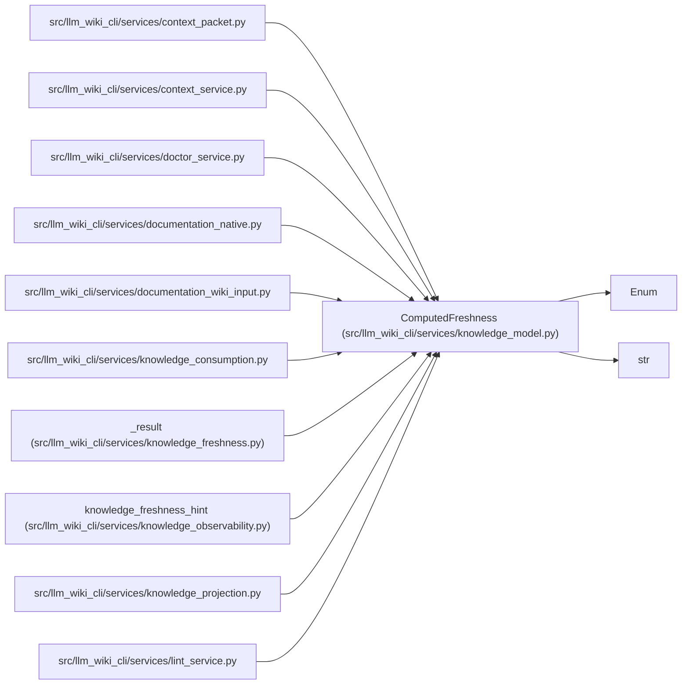

# ComputedFreshness

**Location:** `src/llm_wiki_cli/services/knowledge_model.py:170`
**Kind:** Enum
**Bases:** `str`, `Enum`
**Module:** [knowledge_model](../modules/knowledge_model.md)

## Description

Live comparison outcomes; never serialized in the knowledge index.

## Attributes

| Name | Declared value | Description |
|------|-------|-------------|
| `UNKNOWN` | `'unknown'` | — |
| `CURRENT` | `'current'` | — |
| `NONSEMANTIC_SOURCE_CHANGE` | `'nonsemantic-source-change'` | — |
| `SOURCE_CHANGED` | `'source-changed'` | — |
| `BASIS_INCOMPATIBLE` | `'basis-incompatible'` | — |
| `SOURCE_MISSING` | `'source-missing'` | — |

## Methods

*No public methods. Inherits from base classes.*

## Relationships

<!-- Auto-generated relationship summary. Do not edit by hand. -->

### Summary

| Module | Methods | Attributes |
|---|---:|---|
| [knowledge_model](../modules/knowledge_model.md) | 0 | `BASIS_INCOMPATIBLE`, `CURRENT`, `NONSEMANTIC_SOURCE_CHANGE`, `SOURCE_CHANGED`, `SOURCE_MISSING`, `UNKNOWN` |

### Structure

| Kind | Entity | Module |
|---|---|---|
| Base | `Enum` | — |
| Base | `str` | — |

### References

| Reference | Kind | Source |
|---|---|---|
| `context_packet` | import | [context_packet](../modules/context_packet.md) |
| `context_service` | import | [context_service](../modules/context_service.md) |
| `doctor_service` | import | [doctor_service](../modules/doctor_service.md) |
| `documentation_native` | import | [documentation_native](../modules/documentation_native.md) |
| `documentation_wiki_input` | import | [documentation_wiki_input](../modules/documentation_wiki_input.md) |
| `knowledge_consumption` | import | [knowledge_consumption](../modules/knowledge_consumption.md) |
| `_result` | type_reference | [knowledge_freshness](../modules/knowledge_freshness.md) |
| `knowledge_freshness_hint` | type_reference | [knowledge_observability](../modules/knowledge_observability.md) |
| `knowledge_projection` | import | [knowledge_projection](../modules/knowledge_projection.md) |
| `lint_service` | import | [lint_service](../modules/lint_service.md) |
