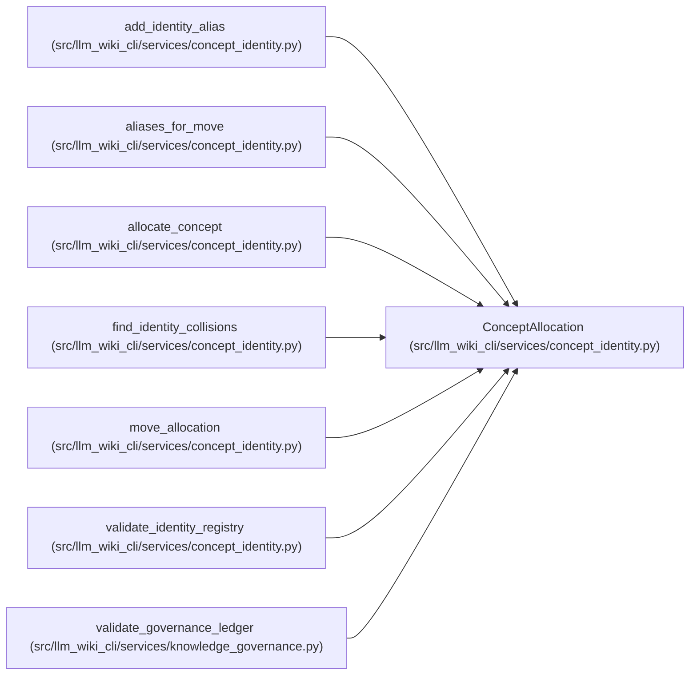

# ConceptAllocation

**Location:** `src/llm_wiki_cli/services/concept_identity.py:115`
**Kind:** Class
**Bases:** —
**Module:** [concept_identity](../modules/concept_identity.md)

**Decorators:** `@dataclass(frozen=True)`

## Description

A persisted UID bound to the concept's current coordinates.

## Attributes

| Name | Type | Default | Description |
|------|------|---------|-------------|
| `uid` | `str` | *required* | — |
| `concept_kind` | `str` | *required* | — |
| `natural_key` | `str` | *required* | — |
| `locator` | `str` | *required* | — |

## Methods

| Method | Signature | Decorators | Description |
|--------|-----------|------------|-------------|
| `__post_init__` | `() -> None` | — | — |
| `reference` | `() -> ConceptReference` | `@property` | Return the allocation's current regenerable reference. |

## Relationships

<!-- Auto-generated relationship summary. Do not edit by hand. -->

### Summary

| Module | Methods | Attributes |
|---|---:|---|
| [concept_identity](../modules/concept_identity.md) | 2 | `concept_kind`, `locator`, `natural_key`, `uid` |

### References

| Reference | Kind | Source | Call sites |
|---|---|---|---:|
| `add_identity_alias` | type_reference | [concept_identity](../modules/concept_identity.md) | — |
| `aliases_for_move` | type_reference | [concept_identity](../modules/concept_identity.md) | — |
| `allocate_concept` | call | [concept_identity](../modules/concept_identity.md) | 1 |
| `allocate_concept` | type_reference | [concept_identity](../modules/concept_identity.md) | — |
| `find_identity_collisions` | type_reference | [concept_identity](../modules/concept_identity.md) | — |
| `move_allocation` | call | [concept_identity](../modules/concept_identity.md) | 1 |
| `move_allocation` | type_reference | [concept_identity](../modules/concept_identity.md) | — |
| `validate_identity_registry` | type_reference | [concept_identity](../modules/concept_identity.md) | — |
| `validate_governance_ledger` | call | [knowledge_governance](../modules/knowledge_governance.md) | 1 |
