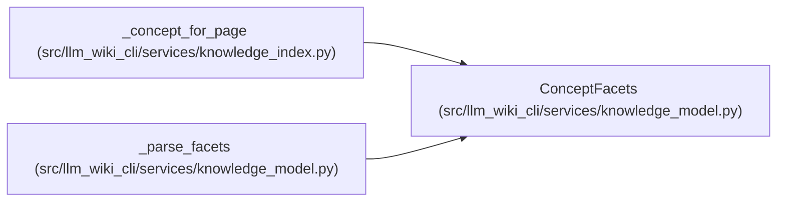

# ConceptFacets

**Location:** `src/llm_wiki_cli/services/knowledge_model.py:364`
**Kind:** Class
**Bases:** —
**Module:** [knowledge_model](../modules/knowledge_model.md)

**Decorators:** `@dataclass(frozen=True)`

## Description

_Auto-generated from `ConceptFacets` in `src/llm_wiki_cli/services/knowledge_model.py`._

## Attributes

| Name | Type | Default | Description |
|------|------|---------|-------------|
| `structure` | `StructuralFacet` | *required* | — |
| `semantics` | `SemanticFacet` | *required* | — |
| `extensions` | `Extensions` | `field(default_factory=dict)` | — |

## Methods

*No public methods. Inherits from base classes.*

## Relationships

<!-- Auto-generated relationship summary. Do not edit by hand. -->

### Summary

| Module | Methods | Attributes |
|---|---:|---|
| [knowledge_model](../modules/knowledge_model.md) | 0 | `extensions`, `semantics`, `structure` |

### References

| Reference | Kind | Source |
|---|---|---|
| `_concept_for_page` | call | [knowledge_index](../modules/knowledge_index.md) |
| `_parse_facets` | call | [knowledge_model](../modules/knowledge_model.md) |
| `_parse_facets` | type_reference | [knowledge_model](../modules/knowledge_model.md) |
