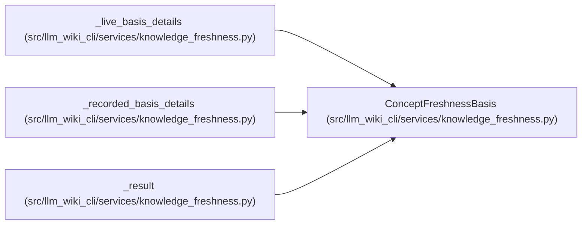

# ConceptFreshnessBasis

**Location:** `src/llm_wiki_cli/services/knowledge_freshness.py:177`
**Kind:** Class
**Bases:** —
**Module:** [knowledge_freshness](../modules/knowledge_freshness.md)

**Decorators:** `@dataclass(frozen=True)`

## Description

Normalized recorded or live concept basis returned to consumers.

## Attributes

| Name | Type | Default | Description |
|------|------|---------|-------------|
| `scope` | `ObservationScope` | *required* | — |
| `source_path` | `str` | *required* | — |
| `extractor_ref` | `str` | *required* | — |
| `source_content_hash` | `str` | *required* | — |
| `concept_observation_hash` | `str \| None` | *required* | — |
| `analysis_basis_hash` | `str \| None` | *required* | — |
| `unknown_reason` | `str \| None` | `None` | — |

## Methods

*No public methods. Inherits from base classes.*

## Relationships

<!-- Auto-generated relationship summary. Do not edit by hand. -->

### Summary

| Module | Methods | Attributes |
|---|---:|---|
| [knowledge_freshness](../modules/knowledge_freshness.md) | 0 | `analysis_basis_hash`, `concept_observation_hash`, `extractor_ref`, `scope`, `source_content_hash`, `source_path`, `unknown_reason` |

### References

| Reference | Kind | Source | Call sites |
|---|---|---|---:|
| `_live_basis_details` | call | [knowledge_freshness](../modules/knowledge_freshness.md) | 1 |
| `_live_basis_details` | type_reference | [knowledge_freshness](../modules/knowledge_freshness.md) | — |
| `_recorded_basis_details` | call | [knowledge_freshness](../modules/knowledge_freshness.md) | 1 |
| `_recorded_basis_details` | type_reference | [knowledge_freshness](../modules/knowledge_freshness.md) | — |
| `_result` | type_reference | [knowledge_freshness](../modules/knowledge_freshness.md) | — |
