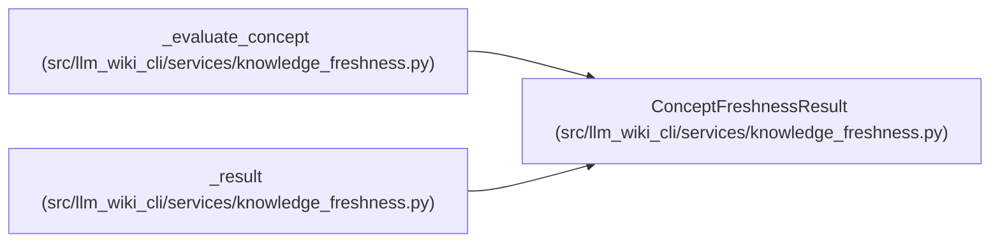

# ConceptFreshnessResult

**Location:** `src/llm_wiki_cli/services/knowledge_freshness.py:190`
**Kind:** Class
**Bases:** —
**Module:** [knowledge_freshness](../modules/knowledge_freshness.md)

**Decorators:** `@dataclass(frozen=True)`

## Description

One consumer-computed freshness outcome.

## Attributes

| Name | Type | Default | Description |
|------|------|---------|-------------|
| `locator` | `str` | *required* | — |
| `state` | `ComputedFreshness` | *required* | — |
| `reason_code` | `str` | *required* | — |
| `recorded_basis` | `ConceptFreshnessBasis \| None` | *required* | — |
| `live_basis` | `ConceptFreshnessBasis \| None` | *required* | — |
| `live_comparison_performed` | `bool` | *required* | — |
| `description` | `str` | *required* | — |

## Methods

*No public methods. Inherits from base classes.*

## Relationships

<!-- Auto-generated relationship summary. Do not edit by hand. -->

### Summary

| Module | Methods | Attributes |
|---|---:|---|
| [knowledge_freshness](../modules/knowledge_freshness.md) | 0 | `description`, `live_basis`, `live_comparison_performed`, `locator`, `reason_code`, `recorded_basis`, `state` |

### References

| Reference | Kind | Source |
|---|---|---|
| `_evaluate_concept` | type_reference | [knowledge_freshness](../modules/knowledge_freshness.md) |
| `_result` | call | [knowledge_freshness](../modules/knowledge_freshness.md) |
| `_result` | type_reference | [knowledge_freshness](../modules/knowledge_freshness.md) |
