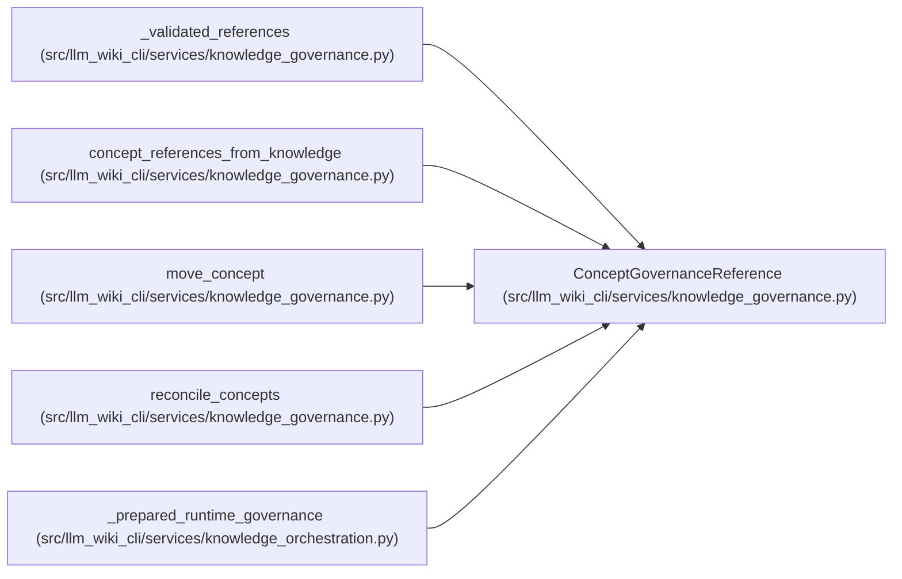

# ConceptGovernanceReference

**Location:** `src/llm_wiki_cli/services/knowledge_governance.py:337`
**Kind:** Class
**Bases:** —
**Module:** [knowledge_governance](../modules/knowledge_governance.md)

**Decorators:** `@dataclass(frozen=True)`

## Description

Current generated concept coordinates used for reconciliation.

## Attributes

| Name | Type | Default | Description |
|------|------|---------|-------------|
| `locator` | `str` | *required* | — |
| `concept_kind` | `str` | *required* | — |
| `natural_key` | `str` | *required* | — |

## Methods

*No public methods. Inherits from base classes.*

## Relationships

<!-- Auto-generated relationship summary. Do not edit by hand. -->

### Summary

| Module | Methods | Attributes |
|---|---:|---|
| [knowledge_governance](../modules/knowledge_governance.md) | 0 | `concept_kind`, `locator`, `natural_key` |

### References

| Reference | Kind | Source |
|---|---|---|
| `_validated_references` | call | [knowledge_governance](../modules/knowledge_governance.md) |
| `_validated_references` | type_reference | [knowledge_governance](../modules/knowledge_governance.md) |
| `concept_references_from_knowledge` | call | [knowledge_governance](../modules/knowledge_governance.md) |
| `concept_references_from_knowledge` | type_reference | [knowledge_governance](../modules/knowledge_governance.md) |
| `move_concept` | call | [knowledge_governance](../modules/knowledge_governance.md) |
| `reconcile_concepts` | type_reference | [knowledge_governance](../modules/knowledge_governance.md) |
| `_prepared_runtime_governance` | call | [knowledge_orchestration](../modules/knowledge_orchestration.md) |
