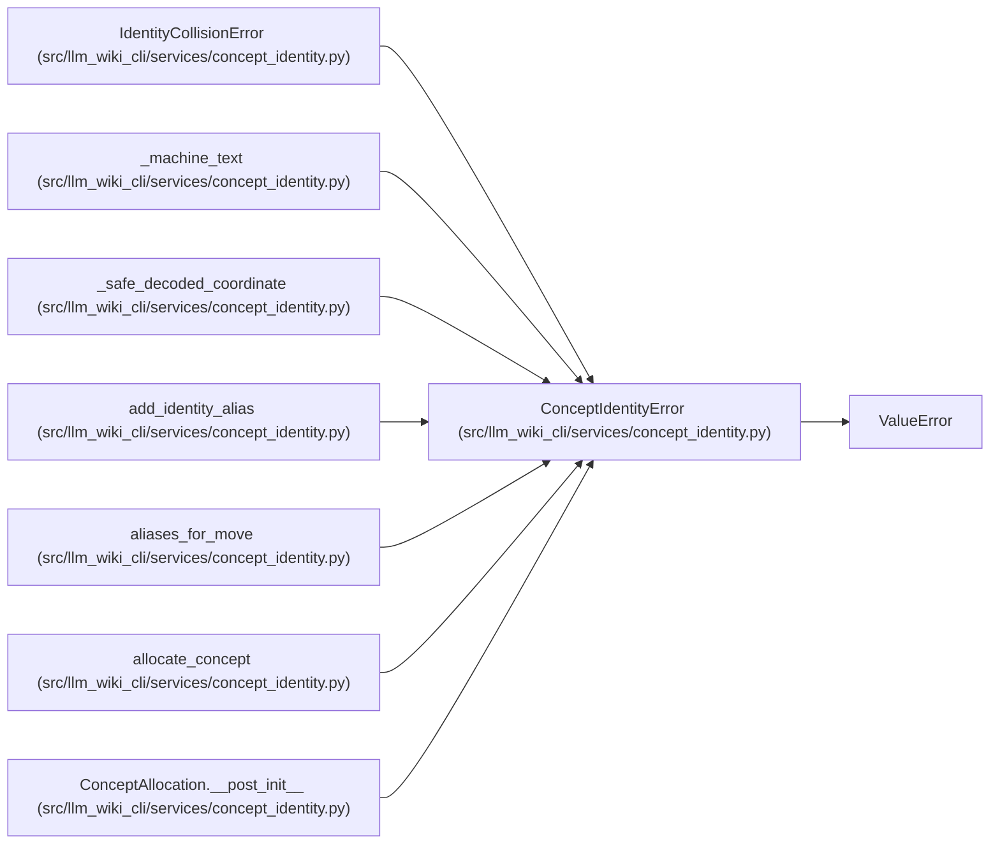

# ConceptIdentityError

**Location:** `src/llm_wiki_cli/services/concept_identity.py:75`
**Kind:** Class
**Bases:** `ValueError`
**Module:** [concept_identity](../modules/concept_identity.md)

## Description

Field-specific validation failure for stable concept identity.

## Attributes

*No annotated attributes found.*

## Methods

| Method | Signature | Decorators | Description |
|--------|-----------|------------|-------------|
| `__init__` | `(field: str, message: str, *, code: str = 'invalid')` | — | — |

## Relationships

<!-- Auto-generated relationship summary. Do not edit by hand. -->

### Summary

| Module | Methods | Attributes |
|---|---:|---|
| [concept_identity](../modules/concept_identity.md) | 1 | — |

### Structure

| Kind | Entity | Module |
|---|---|---|
| Base | `ValueError` | — |
| Subclass | `IdentityCollisionError` | [concept_identity](../modules/concept_identity.md) |

### References

| Reference | Kind | Source |
|---|---|---|
| `_machine_text` | call | [concept_identity](../modules/concept_identity.md) |
| `_machine_text` | call | [concept_identity](../modules/concept_identity.md) |
| `_machine_text` | call | [concept_identity](../modules/concept_identity.md) |
| `_machine_text` | call | [concept_identity](../modules/concept_identity.md) |
| `_machine_text` | call | [concept_identity](../modules/concept_identity.md) |
| `_safe_decoded_coordinate` | call | [concept_identity](../modules/concept_identity.md) |
| `_safe_decoded_coordinate` | call | [concept_identity](../modules/concept_identity.md) |
| `_safe_decoded_coordinate` | call | [concept_identity](../modules/concept_identity.md) |
| `add_identity_alias` | call | [concept_identity](../modules/concept_identity.md) |
| `aliases_for_move` | call | [concept_identity](../modules/concept_identity.md) |
| `allocate_concept` | call | [concept_identity](../modules/concept_identity.md) |
| `ConceptAllocation.__post_init__` | call | [concept_identity](../modules/concept_identity.md) |
