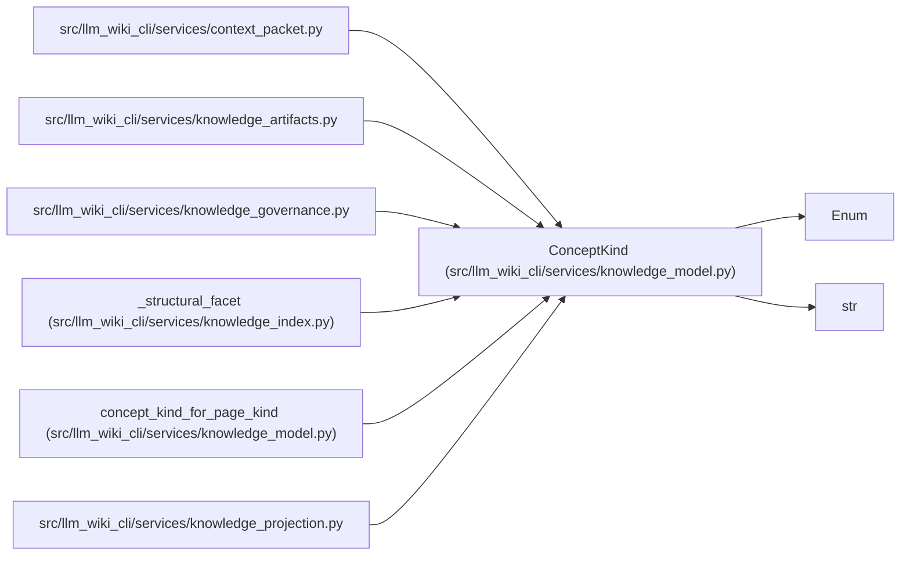

# ConceptKind

**Location:** `src/llm_wiki_cli/services/knowledge_model.py:93`
**Kind:** Enum
**Bases:** `str`, `Enum`
**Module:** [knowledge_model](../modules/knowledge_model.md)

## Description

Versioned domain taxonomy independent of the current page layout.

## Attributes

| Name | Declared value | Description |
|------|-------|-------------|
| `SOURCE_MODULE` | `'source-module'` | — |
| `CODE_ENTITY` | `'code-entity'` | — |
| `WORKFLOW` | `'workflow'` | — |
| `GUIDE` | `'guide'` | — |
| `USER_FLOW` | `'user-flow'` | — |
| `INFRASTRUCTURE_RESOURCE` | `'infrastructure-resource'` | — |
| `API_CONTRACT` | `'api-contract'` | — |
| `DEPENDENCY_VIEW` | `'dependency-view'` | — |
| `NAVIGATION_DOCUMENT` | `'navigation-document'` | — |
| `CHANGE_LOG_DOCUMENT` | `'change-log-document'` | — |

## Methods

| Method | Signature | Decorators | Description |
|--------|-----------|------------|-------------|
| `is_document_only` | `() -> bool` | `@property` | — |

## Relationships

<!-- Auto-generated relationship summary. Do not edit by hand. -->

### Summary

| Module | Methods | Attributes |
|---|---:|---|
| [knowledge_model](../modules/knowledge_model.md) | 1 | `API_CONTRACT`, `CHANGE_LOG_DOCUMENT`, `CODE_ENTITY`, `DEPENDENCY_VIEW`, `GUIDE`, `INFRASTRUCTURE_RESOURCE`, `NAVIGATION_DOCUMENT`, `SOURCE_MODULE`, `USER_FLOW`, `WORKFLOW` |

### Structure

| Kind | Entity | Module |
|---|---|---|
| Base | `Enum` | — |
| Base | `str` | — |

### References

| Reference | Kind | Source | Call sites |
|---|---|---|---:|
| `context_packet` | import | [context_packet](../modules/context_packet.md) | — |
| `knowledge_artifacts` | import | [knowledge_artifacts](../modules/knowledge_artifacts.md) | — |
| `knowledge_governance` | import | [knowledge_governance](../modules/knowledge_governance.md) | — |
| `_structural_facet` | type_reference | [knowledge_index](../modules/knowledge_index.md) | — |
| `concept_kind_for_page_kind` | type_reference | [knowledge_model](../modules/knowledge_model.md) | — |
| `knowledge_projection` | import | [knowledge_projection](../modules/knowledge_projection.md) | — |
