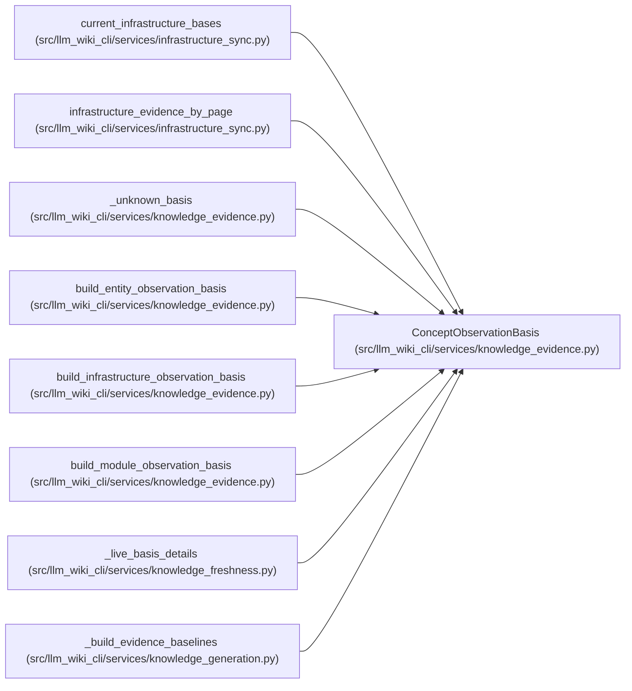

# ConceptObservationBasis

**Location:** `src/llm_wiki_cli/services/knowledge_evidence.py:83`
**Kind:** Class
**Bases:** —
**Module:** [knowledge_evidence](../modules/knowledge_evidence.md)

**Decorators:** `@dataclass(frozen=True)`

## Description

One source-backed concept observation basis or explicit unknown result.

``unknown_reason`` is service-level diagnostic state and is not a v1 core
field. :meth:`to_evidence_payload` returns only fields accepted by the
persisted :class:`knowledge_model.EvidenceBasis` contract.

## Attributes

| Name | Type | Default | Description |
|------|------|---------|-------------|
| `scope` | `str` | *required* | — |
| `source_path` | `str` | *required* | — |
| `extractor_ref` | `str` | *required* | — |
| `source_content_hash` | `str` | *required* | — |
| `concept_observation_hash` | `str \| None` | *required* | — |
| `unknown_reason` | `str \| None` | `None` | — |

## Methods

| Method | Signature | Decorators | Description |
|--------|-----------|------------|-------------|
| `__post_init__` | `() -> None` | — | — |
| `is_known` | `() -> bool` | `@property` | Return whether this basis carries a reproducible observation hash. |
| `to_evidence_payload` | `() -> dict[str, str]` | — | Return the v1-compatible evidence-basis fields. |

## Relationships

<!-- Auto-generated relationship summary. Do not edit by hand. -->

### Summary

| Module | Methods | Attributes |
|---|---:|---|
| [knowledge_evidence](../modules/knowledge_evidence.md) | 3 | `concept_observation_hash`, `extractor_ref`, `scope`, `source_content_hash`, `source_path`, `unknown_reason` |

### References

| Reference | Kind | Source |
|---|---|---|
| `current_infrastructure_bases` | type_reference | [infrastructure_sync](../modules/infrastructure_sync.md) |
| `infrastructure_evidence_by_page` | type_reference | [infrastructure_sync](../modules/infrastructure_sync.md) |
| `_unknown_basis` | call | [knowledge_evidence](../modules/knowledge_evidence.md) |
| `_unknown_basis` | type_reference | [knowledge_evidence](../modules/knowledge_evidence.md) |
| `build_entity_observation_basis` | call | [knowledge_evidence](../modules/knowledge_evidence.md) |
| `build_entity_observation_basis` | type_reference | [knowledge_evidence](../modules/knowledge_evidence.md) |
| `build_infrastructure_observation_basis` | call | [knowledge_evidence](../modules/knowledge_evidence.md) |
| `build_infrastructure_observation_basis` | type_reference | [knowledge_evidence](../modules/knowledge_evidence.md) |
| `build_module_observation_basis` | call | [knowledge_evidence](../modules/knowledge_evidence.md) |
| `build_module_observation_basis` | type_reference | [knowledge_evidence](../modules/knowledge_evidence.md) |
| `_live_basis_details` | type_reference | [knowledge_freshness](../modules/knowledge_freshness.md) |
| `_build_evidence_baselines` | type_reference | [knowledge_generation](../modules/knowledge_generation.md) |
