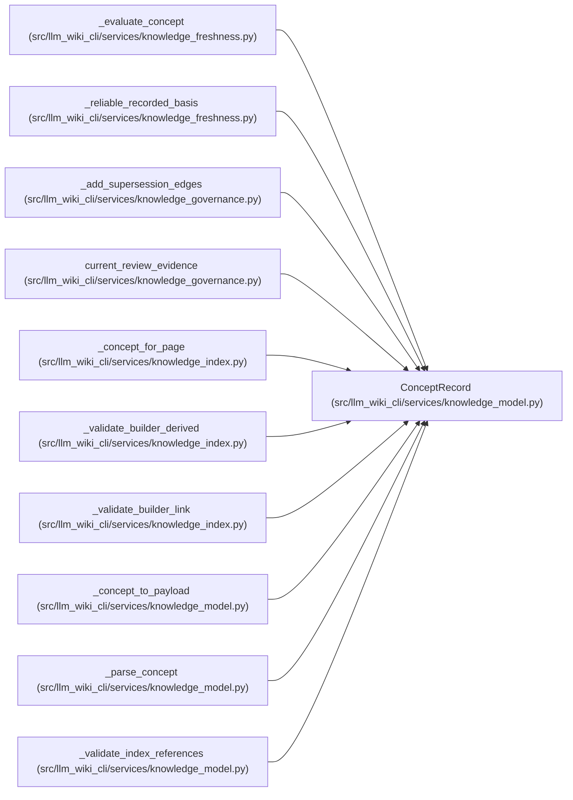

# ConceptRecord

**Location:** `src/llm_wiki_cli/services/knowledge_model.py:371`
**Kind:** Class
**Bases:** —
**Module:** [knowledge_model](../modules/knowledge_model.md)

**Decorators:** `@dataclass(frozen=True)`

## Description

_Auto-generated from `ConceptRecord` in `src/llm_wiki_cli/services/knowledge_model.py`._

## Attributes

| Name | Type | Default | Description |
|------|------|---------|-------------|
| `locator` | `str` | *required* | — |
| `concept_kind` | `ConceptKindValue` | *required* | — |
| `title` | `str` | *required* | — |
| `document` | `DocumentRecord` | *required* | — |
| `facets` | `ConceptFacets` | *required* | — |
| `lifecycle` | `Lifecycle` | `Lifecycle.UNKNOWN` | — |
| `extensions` | `Extensions` | `field(default_factory=dict)` | — |

## Methods

*No public methods. Inherits from base classes.*

## Relationships

<!-- Auto-generated relationship summary. Do not edit by hand. -->

### Summary

| Module | Methods | Attributes |
|---|---:|---|
| [knowledge_model](../modules/knowledge_model.md) | 0 | `concept_kind`, `document`, `extensions`, `facets`, `lifecycle`, `locator`, `title` |

### References

| Reference | Kind | Source | Call sites |
|---|---|---|---:|
| `_evaluate_concept` | type_reference | [knowledge_freshness](../modules/knowledge_freshness.md) | — |
| `_reliable_recorded_basis` | type_reference | [knowledge_freshness](../modules/knowledge_freshness.md) | — |
| `_add_supersession_edges` | type_reference | [knowledge_governance](../modules/knowledge_governance.md) | — |
| `current_review_evidence` | type_reference | [knowledge_governance](../modules/knowledge_governance.md) | — |
| `_concept_for_page` | call | [knowledge_index](../modules/knowledge_index.md) | 1 |
| `_concept_for_page` | type_reference | [knowledge_index](../modules/knowledge_index.md) | — |
| `_validate_builder_derived` | type_reference | [knowledge_index](../modules/knowledge_index.md) | — |
| `_validate_builder_link` | type_reference | [knowledge_index](../modules/knowledge_index.md) | — |
| `_concept_to_payload` | type_reference | [knowledge_model](../modules/knowledge_model.md) | — |
| `_parse_concept` | call | [knowledge_model](../modules/knowledge_model.md) | 1 |
| `_parse_concept` | type_reference | [knowledge_model](../modules/knowledge_model.md) | — |
| `_validate_index_references` | type_reference | [knowledge_model](../modules/knowledge_model.md) | — |

> References: showing 12 of 21 logical references; 9 omitted by the 12-row generated summary limit.
