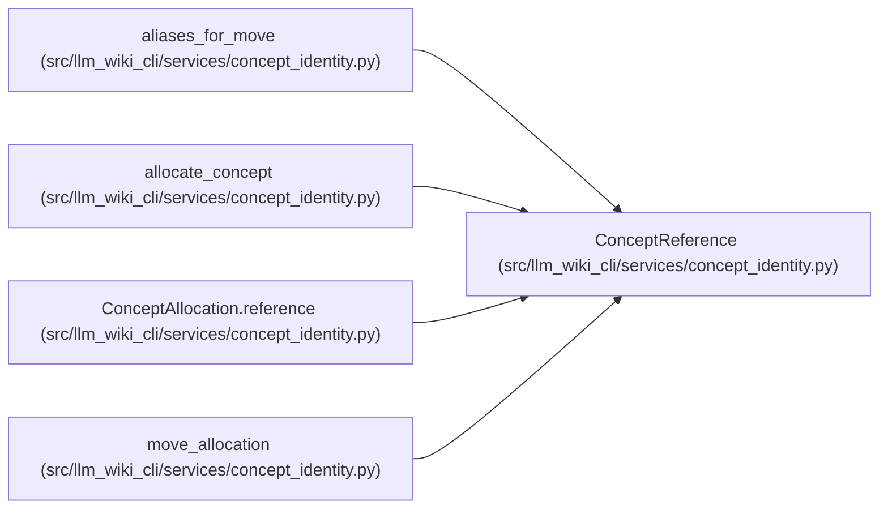

# ConceptReference

**Location:** `src/llm_wiki_cli/services/concept_identity.py:93`
**Kind:** Class
**Bases:** —
**Module:** [concept_identity](../modules/concept_identity.md)

**Decorators:** `@dataclass(frozen=True)`

## Description

One current, regenerable concept coordinate before UID allocation.

## Attributes

| Name | Type | Default | Description |
|------|------|---------|-------------|
| `locator` | `str` | *required* | — |
| `concept_kind` | `str` | *required* | — |
| `natural_key` | `str` | *required* | — |

## Methods

| Method | Signature | Decorators | Description |
|--------|-----------|------------|-------------|
| `__post_init__` | `() -> None` | — | — |

## Relationships

<!-- Auto-generated relationship summary. Do not edit by hand. -->

### Summary

| Module | Methods | Attributes |
|---|---:|---|
| [concept_identity](../modules/concept_identity.md) | 1 | `concept_kind`, `locator`, `natural_key` |

### References

| Reference | Kind | Source |
|---|---|---|
| `aliases_for_move` | type_reference | [concept_identity](../modules/concept_identity.md) |
| `allocate_concept` | type_reference | [concept_identity](../modules/concept_identity.md) |
| `ConceptAllocation.reference` | call | [concept_identity](../modules/concept_identity.md) |
| `ConceptAllocation.reference` | type_reference | [concept_identity](../modules/concept_identity.md) |
| `move_allocation` | type_reference | [concept_identity](../modules/concept_identity.md) |
