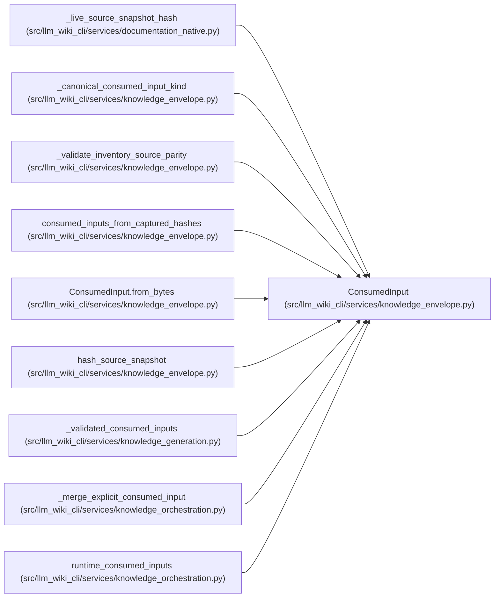

# ConsumedInput

**Location:** `src/llm_wiki_cli/services/knowledge_envelope.py:123`
**Kind:** Class
**Bases:** —
**Module:** [knowledge_envelope](../modules/knowledge_envelope.md)

**Decorators:** `@dataclass(frozen=True)`

## Description

One already captured repository-relative content commitment.

## Attributes

| Name | Type | Default | Description |
|------|------|---------|-------------|
| `path` | `str` | *required* | — |
| `content_hash` | `str` | *required* | — |
| `kind` | `ConsumedInputKind \| str` | `ConsumedInputKind.SOURCE` | — |

## Methods

| Method | Signature | Decorators | Description |
|--------|-----------|------------|-------------|
| `__post_init__` | `() -> None` | — | — |
| `from_bytes` | `(path: str, content: bytes, *, kind: ConsumedInputKind \| str = ConsumedInputKind.SOURCE) -> ConsumedInput` | `@classmethod` | Capture exact bytes without retaining them in the envelope input. |
| `kind_value` | `() -> str` | `@property` | — |

## Relationships

<!-- Auto-generated relationship summary. Do not edit by hand. -->

### Summary

| Module | Methods | Attributes |
|---|---:|---|
| [knowledge_envelope](../modules/knowledge_envelope.md) | 3 | `content_hash`, `kind`, `path` |

### References

| Reference | Kind | Source |
|---|---|---|
| `_live_source_snapshot_hash` | call | [documentation_native](../modules/documentation_native.md) |
| `_live_source_snapshot_hash` | call | [documentation_native](../modules/documentation_native.md) |
| `_canonical_consumed_input_kind` | type_reference | [knowledge_envelope](../modules/knowledge_envelope.md) |
| `_validate_inventory_source_parity` | type_reference | [knowledge_envelope](../modules/knowledge_envelope.md) |
| `consumed_inputs_from_captured_hashes` | call | [knowledge_envelope](../modules/knowledge_envelope.md) |
| `consumed_inputs_from_captured_hashes` | type_reference | [knowledge_envelope](../modules/knowledge_envelope.md) |
| `ConsumedInput.from_bytes` | type_reference | [knowledge_envelope](../modules/knowledge_envelope.md) |
| `hash_source_snapshot` | type_reference | [knowledge_envelope](../modules/knowledge_envelope.md) |
| `_validated_consumed_inputs` | type_reference | [knowledge_generation](../modules/knowledge_generation.md) |
| `_merge_explicit_consumed_input` | call | [knowledge_orchestration](../modules/knowledge_orchestration.md) |
| `_merge_explicit_consumed_input` | type_reference | [knowledge_orchestration](../modules/knowledge_orchestration.md) |
| `runtime_consumed_inputs` | type_reference | [knowledge_orchestration](../modules/knowledge_orchestration.md) |
