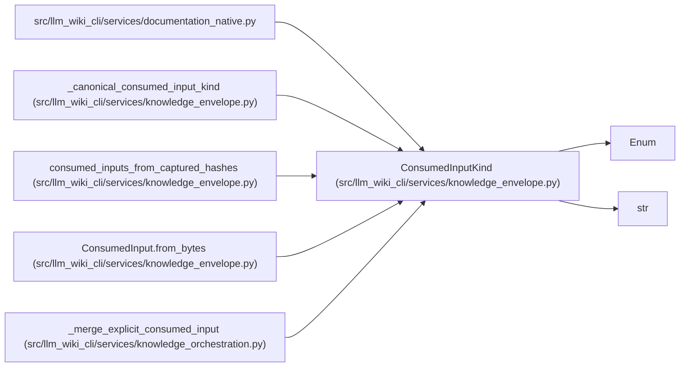

# ConsumedInputKind

**Location:** `src/llm_wiki_cli/services/knowledge_envelope.py:97`
**Kind:** Enum
**Bases:** `str`, `Enum`
**Module:** [knowledge_envelope](../modules/knowledge_envelope.md)

## Description

Known classes of repository/configuration input consumed by a run.

## Attributes

| Name | Declared value | Description |
|------|-------|-------------|
| `SOURCE` | `'source'` | — |
| `DOCKER` | `'docker'` | — |
| `COMPOSE` | `'compose'` | — |
| `YAML` | `'yaml'` | — |
| `PACKAGE` | `'package'` | — |
| `OPENAPI` | `'openapi'` | — |
| `PLUGIN` | `'plugin'` | — |
| `SELECTION` | `'selection'` | — |

## Methods

*No public methods. Inherits from base classes.*

## Relationships

<!-- Auto-generated relationship summary. Do not edit by hand. -->

### Summary

| Module | Methods | Attributes |
|---|---:|---|
| [knowledge_envelope](../modules/knowledge_envelope.md) | 0 | `COMPOSE`, `DOCKER`, `OPENAPI`, `PACKAGE`, `PLUGIN`, `SELECTION`, `SOURCE`, `YAML` |

### Structure

| Kind | Entity | Module |
|---|---|---|
| Base | `Enum` | — |
| Base | `str` | — |

### References

| Reference | Kind | Source |
|---|---|---|
| `documentation_native` | import | [documentation_native](../modules/documentation_native.md) |
| `_canonical_consumed_input_kind` | call | [knowledge_envelope](../modules/knowledge_envelope.md) |
| `_canonical_consumed_input_kind` | type_reference | [knowledge_envelope](../modules/knowledge_envelope.md) |
| `consumed_inputs_from_captured_hashes` | type_reference | [knowledge_envelope](../modules/knowledge_envelope.md) |
| `ConsumedInput.from_bytes` | type_reference | [knowledge_envelope](../modules/knowledge_envelope.md) |
| `_merge_explicit_consumed_input` | type_reference | [knowledge_orchestration](../modules/knowledge_orchestration.md) |
