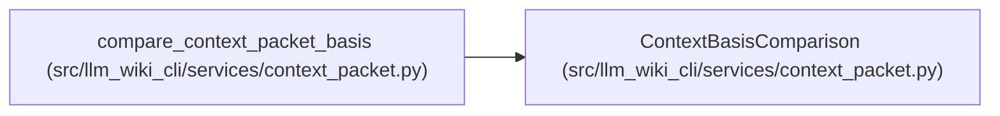

# ContextBasisComparison

**Location:** `src/llm_wiki_cli/services/context_packet.py:429`
**Kind:** Class
**Bases:** —
**Module:** [context_packet](../modules/context_packet.md)

**Decorators:** `@dataclass(frozen=True)`

## Description

Comparison with caller data, which can never assert currentness.

## Attributes

| Name | Type | Default | Description |
|------|------|---------|-------------|
| `packet_id` | `str` | *required* | — |
| `matches_expected` | `bool` | *required* | — |
| `facet_matches` | `Mapping[str, bool]` | *required* | — |
| `current` | `None` | `None` | — |
| `reason` | `str` | `'caller-basis-comparison-is-not-live-reconciliation'` | — |

## Methods

| Method | Signature | Decorators | Description |
|--------|-----------|------------|-------------|
| `to_payload` | `() -> dict[str, Any]` | — | — |

## Relationships

<!-- Auto-generated relationship summary. Do not edit by hand. -->

### Summary

| Module | Methods | Attributes |
|---|---:|---|
| [context_packet](../modules/context_packet.md) | 1 | `current`, `facet_matches`, `matches_expected`, `packet_id`, `reason` |

### References

| Reference | Kind | Source |
|---|---|---|
| `compare_context_packet_basis` | call | [context_packet](../modules/context_packet.md) |
| `compare_context_packet_basis` | type_reference | [context_packet](../modules/context_packet.md) |
