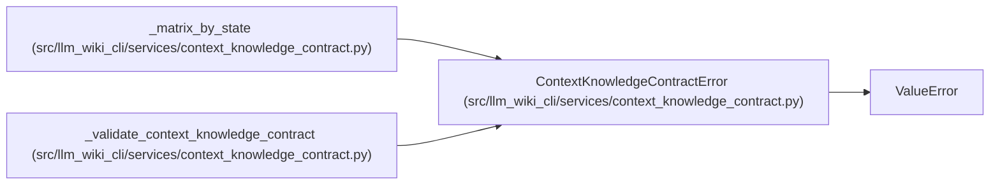

# ContextKnowledgeContractError

**Location:** `src/llm_wiki_cli/services/context_knowledge_contract.py:1369`
**Kind:** Class
**Bases:** `ValueError`
**Module:** [context_knowledge_contract](../modules/context_knowledge_contract.md)

## Description

A serialized context-knowledge contract violates the frozen shape.

## Attributes

*No annotated attributes found.*

## Methods

*No public methods. Inherits from base classes.*

## Relationships

<!-- Auto-generated relationship summary. Do not edit by hand. -->

### Summary

| Module | Methods | Attributes |
|---|---:|---|
| [context_knowledge_contract](../modules/context_knowledge_contract.md) | 0 | — |

### Structure

| Kind | Entity | Module |
|---|---|---|
| Base | `ValueError` | — |

### References

| Reference | Kind | Source |
|---|---|---|
| `_matrix_by_state` | call | [context_knowledge_contract](../modules/context_knowledge_contract.md) |
| `_matrix_by_state` | call | [context_knowledge_contract](../modules/context_knowledge_contract.md) |
| `_matrix_by_state` | call | [context_knowledge_contract](../modules/context_knowledge_contract.md) |
| `_matrix_by_state` | call | [context_knowledge_contract](../modules/context_knowledge_contract.md) |
| `_matrix_by_state` | call | [context_knowledge_contract](../modules/context_knowledge_contract.md) |
| `_matrix_by_state` | call | [context_knowledge_contract](../modules/context_knowledge_contract.md) |
| `_validate_context_knowledge_contract` | call | [context_knowledge_contract](../modules/context_knowledge_contract.md) |
| `_validate_context_knowledge_contract` | call | [context_knowledge_contract](../modules/context_knowledge_contract.md) |
| `_validate_context_knowledge_contract` | call | [context_knowledge_contract](../modules/context_knowledge_contract.md) |
| `_validate_context_knowledge_contract` | call | [context_knowledge_contract](../modules/context_knowledge_contract.md) |
| `_validate_context_knowledge_contract` | call | [context_knowledge_contract](../modules/context_knowledge_contract.md) |
| `_validate_context_knowledge_contract` | call | [context_knowledge_contract](../modules/context_knowledge_contract.md) |
