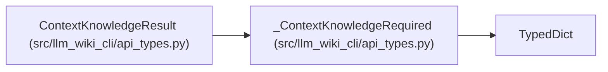

# _ContextKnowledgeRequired

**Location:** `src/llm_wiki_cli/api_types.py:49`
**Kind:** Class
**Bases:** `TypedDict`
**Module:** [api_types](../modules/api_types.md)

## Description

_Auto-generated from `_ContextKnowledgeRequired` in `src/llm_wiki_cli/api_types.py`._

## Attributes

| Name | Type | Default | Description |
|------|------|---------|-------------|
| `mode` | `KnowledgeMode` | *required* | — |
| `status` | `str` | *required* | — |
| `availability` | `str` | *required* | — |
| `reason` | `str` | *required* | — |
| `selected` | `bool` | *required* | — |
| `freshness_evaluated` | `bool` | *required* | — |
| `bounds` | `dict[str, ResultBounds]` | *required* | — |
| `fallback` | `dict[str, Any]` | *required* | — |

## Methods

*No public methods. Inherits from base classes.*

## Relationships

<!-- Auto-generated relationship summary. Do not edit by hand. -->

### Summary

| Module | Methods | Attributes |
|---|---:|---|
| [api_types](../modules/api_types.md) | 0 | `availability`, `bounds`, `fallback`, `freshness_evaluated`, `mode`, `reason`, `selected`, `status` |

### Structure

| Kind | Entity | Module |
|---|---|---|
| Base | `TypedDict` | — |
| Subclass | `ContextKnowledgeResult` | [api_types](../modules/api_types.md) |
