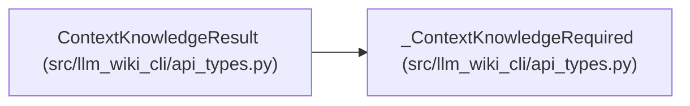

# ContextKnowledgeResult

**Location:** `src/llm_wiki_cli/api_types.py:60`
**Kind:** Class
**Bases:** `_ContextKnowledgeRequired`
**Module:** [api_types](../modules/api_types.md)

## Description

Canonical explicit-mode knowledge outcome.

## Attributes

| Name | Type | Default | Description |
|------|------|---------|-------------|
| `selection` | `ContextKnowledgeSelection` | *required* | — |

## Methods

*No public methods. Inherits from base classes.*

## Relationships

<!-- Auto-generated relationship summary. Do not edit by hand. -->

### Summary

| Module | Methods | Attributes |
|---|---:|---|
| [api_types](../modules/api_types.md) | 0 | `selection` |

### Structure

| Kind | Entity | Module |
|---|---|---|
| Base | `_ContextKnowledgeRequired` | [api_types](../modules/api_types.md) |
