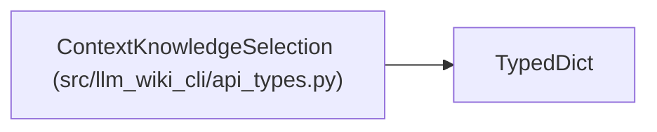

# ContextKnowledgeSelection

**Location:** `src/llm_wiki_cli/api_types.py:40`
**Kind:** Class
**Bases:** `TypedDict`
**Module:** [api_types](../modules/api_types.md)

## Description

Bounded inert content selected by explicit knowledge mode.

## Attributes

| Name | Type | Default | Description |
|------|------|---------|-------------|
| `concepts` | `list[dict[str, Any]]` | *required* | — |
| `pages` | `list[dict[str, Any]]` | *required* | — |
| `relationships` | `list[dict[str, Any]]` | *required* | — |
| `relationship_coverage` | `dict[str, Any]` | *required* | — |

## Methods

*No public methods. Inherits from base classes.*

## Relationships

<!-- Auto-generated relationship summary. Do not edit by hand. -->

### Summary

| Module | Methods | Attributes |
|---|---:|---|
| [api_types](../modules/api_types.md) | 0 | `concepts`, `pages`, `relationship_coverage`, `relationships` |

### Structure

| Kind | Entity | Module |
|---|---|---|
| Base | `TypedDict` | — |
