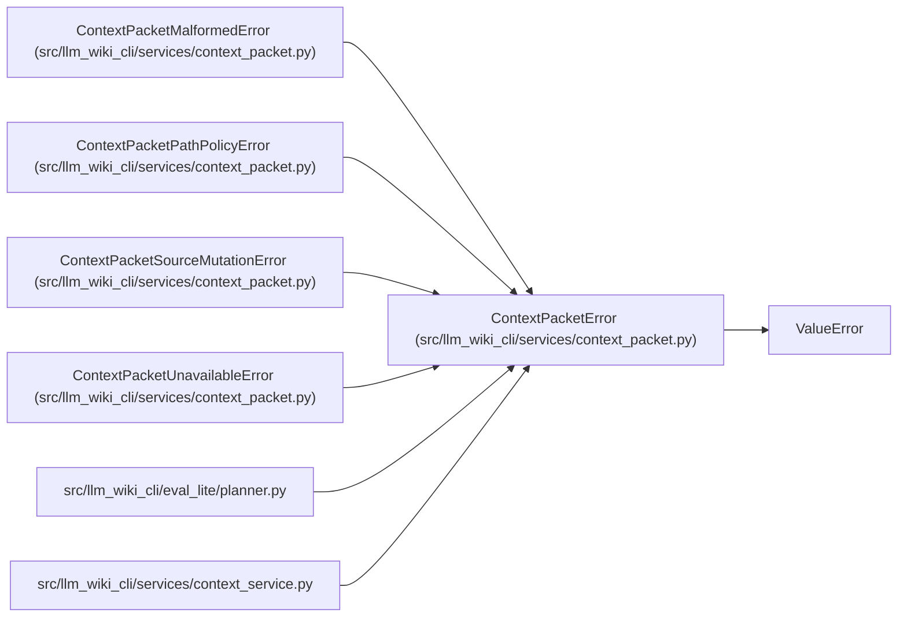

# ContextPacketError

**Location:** `src/llm_wiki_cli/services/context_packet.py:227`
**Kind:** Class
**Bases:** `ValueError`
**Module:** [context_packet](../modules/context_packet.md)

## Description

Base failure for context-packet construction and consumption.

## Attributes

*No annotated attributes found.*

## Methods

*No public methods. Inherits from base classes.*

## Relationships

<!-- Auto-generated relationship summary. Do not edit by hand. -->

### Summary

| Module | Methods | Attributes |
|---|---:|---|
| [context_packet](../modules/context_packet.md) | 0 | — |

### Structure

| Kind | Entity | Module |
|---|---|---|
| Base | `ValueError` | — |
| Subclass | `ContextPacketMalformedError` | [context_packet](../modules/context_packet.md) |
| Subclass | `ContextPacketPathPolicyError` | [context_packet](../modules/context_packet.md) |
| Subclass | `ContextPacketSourceMutationError` | [context_packet](../modules/context_packet.md) |
| Subclass | `ContextPacketUnavailableError` | [context_packet](../modules/context_packet.md) |

### References

| Reference | Kind | Source | Call sites |
|---|---|---|---:|
| `planner` | import | [planner](../modules/planner.md) | — |
| `context_service` | import | [context_service](../modules/context_service.md) | — |
