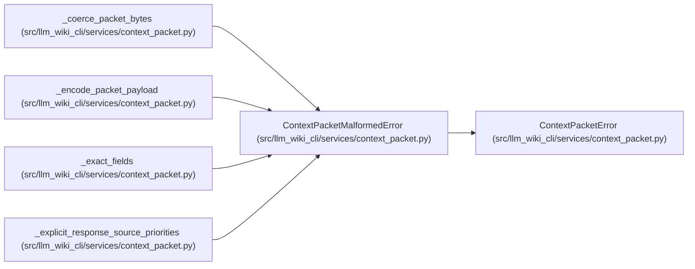

# ContextPacketMalformedError

**Location:** `src/llm_wiki_cli/services/context_packet.py:233`
**Kind:** Class
**Bases:** `ContextPacketError`
**Module:** [context_packet](../modules/context_packet.md)

## Description

The supplied bytes do not satisfy the canonical packet contract.

## Attributes

*No annotated attributes found.*

## Methods

| Method | Signature | Decorators | Description |
|--------|-----------|------------|-------------|
| `__init__` | `(field: str, message: str)` | — | — |

## Relationships

<!-- Auto-generated relationship summary. Do not edit by hand. -->

### Summary

| Module | Methods | Attributes |
|---|---:|---|
| [context_packet](../modules/context_packet.md) | 1 | — |

### Structure

| Kind | Entity | Module |
|---|---|---|
| Base | `ContextPacketError` | [context_packet](../modules/context_packet.md) |

### References

| Reference | Kind | Source |
|---|---|---|
| `_coerce_packet_bytes` | call | [context_packet](../modules/context_packet.md) |
| `_coerce_packet_bytes` | call | [context_packet](../modules/context_packet.md) |
| `_coerce_packet_bytes` | call | [context_packet](../modules/context_packet.md) |
| `_coerce_packet_bytes` | call | [context_packet](../modules/context_packet.md) |
| `_encode_packet_payload` | call | [context_packet](../modules/context_packet.md) |
| `_exact_fields` | call | [context_packet](../modules/context_packet.md) |
| `_exact_fields` | call | [context_packet](../modules/context_packet.md) |
| `_explicit_response_source_priorities` | call | [context_packet](../modules/context_packet.md) |
| `_explicit_response_source_priorities` | call | [context_packet](../modules/context_packet.md) |
| `_explicit_response_source_priorities` | call | [context_packet](../modules/context_packet.md) |
| `_explicit_response_source_priorities` | call | [context_packet](../modules/context_packet.md) |
| `_explicit_response_source_priorities` | call | [context_packet](../modules/context_packet.md) |
