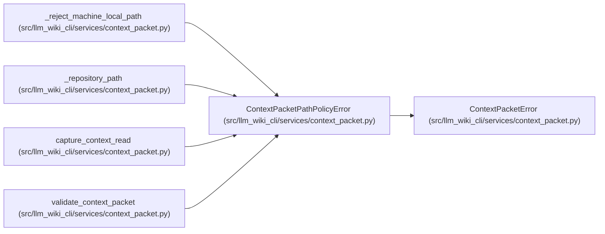

# ContextPacketPathPolicyError

**Location:** `src/llm_wiki_cli/services/context_packet.py:262`
**Kind:** Class
**Bases:** `ContextPacketError`
**Module:** [context_packet](../modules/context_packet.md)

## Description

A structural packet field violates its declared path policy.

## Attributes

*No annotated attributes found.*

## Methods

| Method | Signature | Decorators | Description |
|--------|-----------|------------|-------------|
| `__init__` | `(field: str, message: str)` | — | — |

## Relationships

<!-- Auto-generated relationship summary. Do not edit by hand. -->

### Summary

| Module | Methods | Attributes |
|---|---:|---|
| [context_packet](../modules/context_packet.md) | 1 | — |

### Structure

| Kind | Entity | Module |
|---|---|---|
| Base | `ContextPacketError` | [context_packet](../modules/context_packet.md) |

### References

| Reference | Kind | Source | Call sites |
|---|---|---|---:|
| `_reject_machine_local_path` | type_reference | [context_packet](../modules/context_packet.md) | — |
| `_repository_path` | call | [context_packet](../modules/context_packet.md) | 1 |
| `capture_context_read` | call | [context_packet](../modules/context_packet.md) | 1 |
| `validate_context_packet` | call | [context_packet](../modules/context_packet.md) | 1 |
