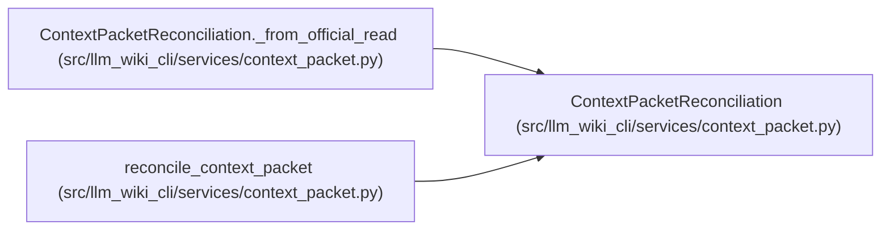

# ContextPacketReconciliation

**Location:** `src/llm_wiki_cli/services/context_packet.py:455`
**Kind:** Class
**Bases:** —
**Module:** [context_packet](../modules/context_packet.md)

**Decorators:** `@dataclass(frozen=True, init=False)`

## Description

Consumer-time comparison against one fresh official read.

## Attributes

| Name | Type | Default | Description |
|------|------|---------|-------------|
| `packet_id` | `str` | *required* | — |
| `policy` | `str` | *required* | — |
| `state` | `str` | *required* | — |
| `current` | `bool \| None` | *required* | — |
| `facets` | `Mapping[str, Mapping[str, Any]]` | *required* | — |
| `limitations` | `tuple[str, ...]` | `()` | — |

## Methods

| Method | Signature | Decorators | Description |
|--------|-----------|------------|-------------|
| `__init__` | `() -> None` | — | — |
| `_from_official_read` | `(*, packet_id: str, policy: str, state: str, current: bool \| None, facets: Mapping[str, Mapping[str, Any]], limitations: Sequence[str] = ()) -> ContextPacketReconciliation` | `@classmethod` | — |
| `to_payload` | `() -> dict[str, Any]` | — | — |

## Relationships

<!-- Auto-generated relationship summary. Do not edit by hand. -->

### Summary

| Module | Methods | Attributes |
|---|---:|---|
| [context_packet](../modules/context_packet.md) | 3 | `current`, `facets`, `limitations`, `packet_id`, `policy`, `state` |

### References

| Reference | Kind | Source | Call sites |
|---|---|---|---:|
| `ContextPacketReconciliation._from_official_read` | type_reference | [context_packet](../modules/context_packet.md) | — |
| `reconcile_context_packet` | type_reference | [context_packet](../modules/context_packet.md) | — |
