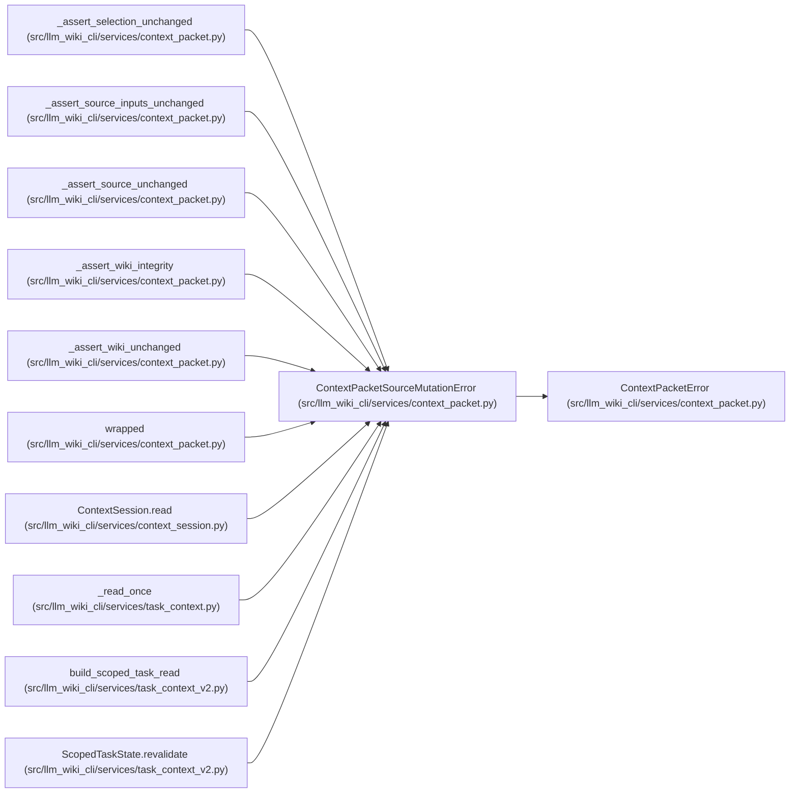

# ContextPacketSourceMutationError

**Location:** `src/llm_wiki_cli/services/context_packet.py:241`
**Kind:** Class
**Bases:** `ContextPacketError`
**Module:** [context_packet](../modules/context_packet.md)

## Description

A captured source or wiki anchor changed before packet return.

## Attributes

*No annotated attributes found.*

## Methods

| Method | Signature | Decorators | Description |
|--------|-----------|------------|-------------|
| `__init__` | `(facet: str)` | — | — |

## Relationships

<!-- Auto-generated relationship summary. Do not edit by hand. -->

### Summary

| Module | Methods | Attributes |
|---|---:|---|
| [context_packet](../modules/context_packet.md) | 1 | — |

### Structure

| Kind | Entity | Module |
|---|---|---|
| Base | `ContextPacketError` | [context_packet](../modules/context_packet.md) |

### References

| Reference | Kind | Source | Call sites |
|---|---|---|---:|
| `_assert_selection_unchanged` | call | [context_packet](../modules/context_packet.md) | 4 |
| `_assert_source_inputs_unchanged` | call | [context_packet](../modules/context_packet.md) | 2 |
| `_assert_source_unchanged` | call | [context_packet](../modules/context_packet.md) | 2 |
| `_assert_wiki_integrity` | call | [context_packet](../modules/context_packet.md) | 1 |
| `_assert_wiki_unchanged` | call | [context_packet](../modules/context_packet.md) | 2 |
| `wrapped` | call | [context_packet](../modules/context_packet.md) | 1 |
| `ContextSession.read` | call | [context_session](../modules/context_session.md) | 1 |
| `_read_once` | call | [task_context](../modules/task_context.md) | 3 |
| `build_scoped_task_read` | call | [task_context_v2](../modules/task_context_v2.md) | 2 |
| `ScopedTaskState.revalidate` | call | [task_context_v2](../modules/task_context_v2.md) | 1 |
