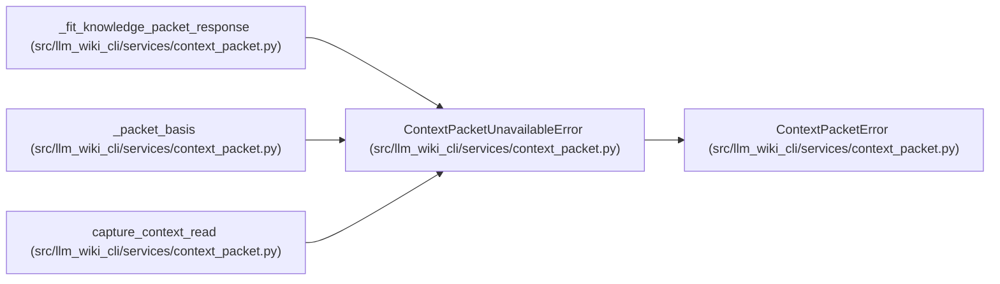

# ContextPacketUnavailableError

**Location:** `src/llm_wiki_cli/services/context_packet.py:256`
**Kind:** Class
**Bases:** `ContextPacketError`
**Module:** [context_packet](../modules/context_packet.md)

## Description

A required read-only packet capability is unavailable.

## Attributes

*No annotated attributes found.*

## Methods

*No public methods. Inherits from base classes.*

## Relationships

<!-- Auto-generated relationship summary. Do not edit by hand. -->

### Summary

| Module | Methods | Attributes |
|---|---:|---|
| [context_packet](../modules/context_packet.md) | 0 | — |

### Structure

| Kind | Entity | Module |
|---|---|---|
| Base | `ContextPacketError` | [context_packet](../modules/context_packet.md) |

### References

| Reference | Kind | Source |
|---|---|---|
| `_fit_knowledge_packet_response` | call | [context_packet](../modules/context_packet.md) |
| `_fit_knowledge_packet_response` | call | [context_packet](../modules/context_packet.md) |
| `_packet_basis` | call | [context_packet](../modules/context_packet.md) |
| `capture_context_read` | call | [context_packet](../modules/context_packet.md) |
| `capture_context_read` | call | [context_packet](../modules/context_packet.md) |
| `capture_context_read` | call | [context_packet](../modules/context_packet.md) |
