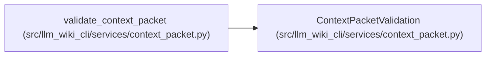

# ContextPacketValidation

**Location:** `src/llm_wiki_cli/services/context_packet.py:254`
**Kind:** Class
**Bases:** —
**Module:** [context_packet](../modules/context_packet.md)

**Decorators:** `@dataclass(frozen=True)`

## Description

Successful structural validation with explicitly unevaluated freshness.

## Attributes

| Name | Type | Default | Description |
|------|------|---------|-------------|
| `packet` | `QualifiedContextPacket` | *required* | — |
| `schema` | `str` | `'valid'` | — |
| `canonical` | `str` | `'valid'` | — |
| `digest` | `str` | `'valid'` | — |
| `path_policy` | `str` | `'valid'` | — |
| `lineage` | `str` | `'valid'` | — |
| `freshness_evaluated` | `bool` | `False` | — |
| `freshness` | `str` | `'unevaluated'` | — |
| `freshness_reason` | `str` | `'structural-validation-has-no-live-basis'` | — |

## Methods

| Method | Signature | Decorators | Description |
|--------|-----------|------------|-------------|
| `valid` | `() -> bool` | `@property` | — |
| `packet_id` | `() -> str` | `@property` | — |
| `to_payload` | `() -> dict[str, Any]` | — | — |

## Relationships

<!-- Auto-generated relationship summary. Do not edit by hand. -->

### Summary

| Module | Methods | Attributes |
|---|---:|---|
| [context_packet](../modules/context_packet.md) | 3 | `canonical`, `digest`, `freshness`, `freshness_evaluated`, `freshness_reason`, `lineage`, `packet`, `path_policy`, `schema` |

### References

| Reference | Kind | Source |
|---|---|---|
| `validate_context_packet` | call | [context_packet](../modules/context_packet.md) |
| `validate_context_packet` | type_reference | [context_packet](../modules/context_packet.md) |
