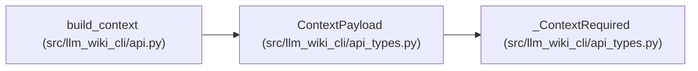

# ContextPayload

**Location:** `src/llm_wiki_cli/api_types.py:118`
**Kind:** Class
**Bases:** `_ContextRequired`
**Module:** [api_types](../modules/api_types.md)

## Description

Top-level JSON context payload.

## Attributes

| Name | Type | Presence | Description |
|------|------|----------|-------------|
| `graphs` | `dict[str, Any]` | *optional* | — |
| `knowledge` | `ContextKnowledgeResult \| dict[str, Any]` | *optional* | — |
| `typed_graph` | `dict[str, Any]` | *optional* | — |
| `surface` | `dict[str, Any]` | *optional* | — |
| `ranking_policy` | `RankingPolicy \| dict[str, Any]` | *optional* | — |
| `warnings` | `list[str]` | *optional* | — |

## Methods

*No public methods. Inherits from base classes.*

## Relationships

<!-- Auto-generated relationship summary. Do not edit by hand. -->

### Summary

| Module | Methods | Attributes |
|---|---:|---|
| [api_types](../modules/api_types.md) | 0 | `graphs`, `knowledge`, `ranking_policy`, `surface`, `typed_graph`, `warnings` |

### Structure

| Kind | Entity | Module |
|---|---|---|
| Base | `_ContextRequired` | [api_types](../modules/api_types.md) |

### References

| Reference | Kind | Source | Call sites |
|---|---|---|---:|
| `build_context` | type_reference | [api](../modules/api.md) | — |
