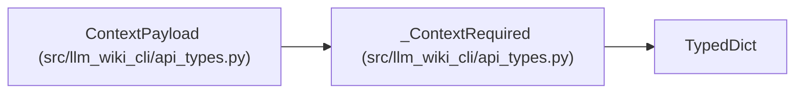

# _ContextRequired

**Location:** `src/llm_wiki_cli/api_types.py:108`
**Kind:** Class
**Bases:** `TypedDict`
**Module:** [api_types](../modules/api_types.md)

## Description

_Auto-generated from `_ContextRequired` in `src/llm_wiki_cli/api_types.py`._

## Attributes

| Name | Type | Default | Description |
|------|------|---------|-------------|
| `budget` | `int` | *required* | — |
| `used` | `int` | *required* | — |
| `truncated` | `bool` | *required* | — |
| `omitted_files` | `list[str]` | *required* | — |
| `downgraded_files` | `dict[str, str]` | *required* | — |
| `bounds` | `dict[str, Any]` | *required* | — |
| `files` | `dict[str, Any]` | *required* | — |

## Methods

*No public methods. Inherits from base classes.*

## Relationships

<!-- Auto-generated relationship summary. Do not edit by hand. -->

### Summary

| Module | Methods | Attributes |
|---|---:|---|
| [api_types](../modules/api_types.md) | 0 | `bounds`, `budget`, `downgraded_files`, `files`, `omitted_files`, `truncated`, `used` |

### Structure

| Kind | Entity | Module |
|---|---|---|
| Base | `TypedDict` | — |
| Subclass | `ContextPayload` | [api_types](../modules/api_types.md) |
