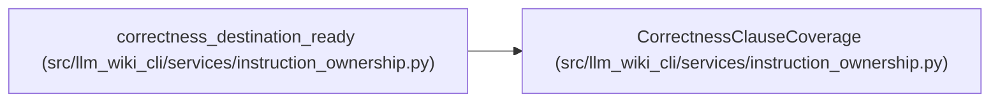

# CorrectnessClauseCoverage

**Location:** `src/llm_wiki_cli/services/instruction_ownership.py:113`
**Kind:** Class
**Bases:** —
**Module:** [instruction_ownership](../modules/instruction_ownership.md)

**Decorators:** `@dataclass(frozen=True)`

## Description

Current correctness rule protected by a canonical ownership decision.

## Attributes

| Name | Type | Default | Description |
|------|------|---------|-------------|
| `name` | `str` | *required* | — |
| `source_section` | `str` | *required* | — |
| `source_text` | `str` | *required* | — |
| `owner` | `InstructionOwner` | *required* | — |
| `destination` | `InstructionDestination` | *required* | — |
| `route` | `InstructionRoute` | *required* | — |
| `origin` | `InstructionOrigin` | `InstructionOrigin.GENERATED_BODY` | — |
| `destination_text` | `str \| None` | `None` | — |
| `always_inline` | `bool` | `False` | — |
| `profiles` | `tuple[SchemaRenderProfile, ...]` | `tuple(SchemaRenderProfile)` | — |
| `agent_targets` | `tuple[str, ...]` | `tuple(SCHEMA_FILENAMES)` | — |

## Methods

*No public methods. Inherits from base classes.*

## Relationships

<!-- Auto-generated relationship summary. Do not edit by hand. -->

### Summary

| Module | Methods | Attributes |
|---|---:|---|
| [instruction_ownership](../modules/instruction_ownership.md) | 0 | `agent_targets`, `always_inline`, `destination`, `destination_text`, `name`, `origin`, `owner`, `profiles`, `route`, `source_section`, `source_text` |

### References

| Reference | Kind | Source |
|---|---|---|
| `correctness_destination_ready` | type_reference | [instruction_ownership](../modules/instruction_ownership.md) |
