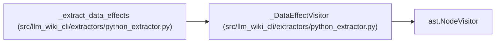

# _DataEffectVisitor

**Location:** `src/llm_wiki_cli/extractors/python_extractor.py:497`
**Kind:** Class
**Bases:** `ast.NodeVisitor`
**Module:** [python_extractor](../modules/python_extractor.md)

## Description

_Auto-generated from `_DataEffectVisitor` in `src/llm_wiki_cli/extractors/python_extractor.py`._

## Attributes

*No annotated attributes found.*

## Methods

| Method | Signature | Decorators | Description |
|--------|-----------|------------|-------------|
| `__init__` | `(module_globals: set[str], local_bindings: set[str], global_declarations: set[str], import_aliases: dict[str, str], return_annotation: str)` | — | — |
| `_add` | `(category: str, record: dict) -> None` | — | — |
| `_add_write_targets` | `(target) -> None` | — | — |
| `visit_FunctionDef` | `(node) -> None` | — | — |
| `visit_AsyncFunctionDef` | `(node) -> None` | — | — |
| `visit_ClassDef` | `(node) -> None` | — | — |
| `visit_Global` | `(node) -> None` | — | — |
| `visit_Call` | `(node) -> None` | — | — |
| `visit_Subscript` | `(node) -> None` | — | — |
| `visit_Attribute` | `(node) -> None` | — | — |
| `visit_Name` | `(node) -> None` | — | — |
| `visit_Assign` | `(node) -> None` | — | — |
| `visit_AnnAssign` | `(node) -> None` | — | — |
| `visit_AugAssign` | `(node) -> None` | — | — |
| `visit_For` | `(node: ast.For \| ast.AsyncFor) -> None` | — | — |
| `visit_AsyncFor` | `(node: ast.AsyncFor) -> None` | — | — |
| `visit_With` | `(node: ast.With \| ast.AsyncWith) -> None` | — | — |
| `visit_AsyncWith` | `(node: ast.AsyncWith) -> None` | — | — |
| `visit_Delete` | `(node) -> None` | — | — |
| `visit_NamedExpr` | `(node) -> None` | — | — |
| `visit_Return` | `(node) -> None` | — | — |

## Relationships

<!-- Auto-generated relationship summary. Do not edit by hand. -->

### Summary

| Module | Methods | Attributes |
|---|---:|---|
| [python_extractor](../modules/python_extractor.md) | 21 | — |

### Structure

| Kind | Entity | Module |
|---|---|---|
| Base | `ast.NodeVisitor` | — |

### References

| Reference | Kind | Source | Call sites |
|---|---|---|---:|
| `_extract_data_effects` | call | [python_extractor](../modules/python_extractor.md) | 1 |
