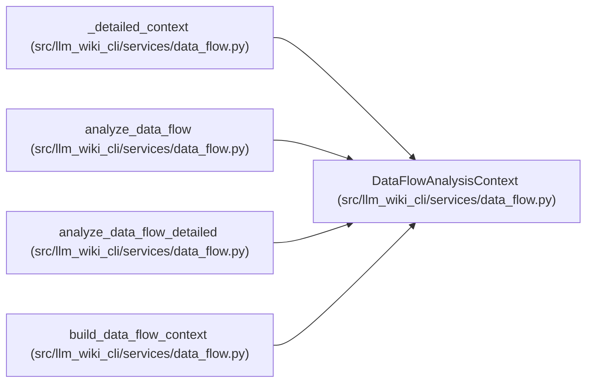

# DataFlowAnalysisContext

**Location:** `src/llm_wiki_cli/services/data_flow.py:164`
**Kind:** Class
**Bases:** —
**Module:** [data_flow](../modules/data_flow.md)

**Decorators:** `@dataclass(frozen=True)`

## Description

Precomputed indexes shared by all data-flow analyses in one run.

## Attributes

| Name | Type | Default | Description |
|------|------|---------|-------------|
| `callable_index` | `dict[tuple[str \| None, str \| None], dict]` | *required* | — |
| `incoming_edges` | `dict[tuple, tuple[dict, ...]]` | *required* | — |
| `data_effect_coverage` | `dict[tuple[str, str], dict[str, dict]] \| None` | `field(default=None)` | — |

## Methods

*No public methods. Inherits from base classes.*

## Relationships

<!-- Auto-generated relationship summary. Do not edit by hand. -->

### Summary

| Module | Methods | Attributes |
|---|---:|---|
| [data_flow](../modules/data_flow.md) | 0 | `callable_index`, `data_effect_coverage`, `incoming_edges` |

### References

| Reference | Kind | Source | Call sites |
|---|---|---|---:|
| `_detailed_context` | call | [data_flow](../modules/data_flow.md) | 1 |
| `_detailed_context` | type_reference | [data_flow](../modules/data_flow.md) | — |
| `analyze_data_flow` | type_reference | [data_flow](../modules/data_flow.md) | — |
| `analyze_data_flow_detailed` | type_reference | [data_flow](../modules/data_flow.md) | — |
| `build_data_flow_context` | call | [data_flow](../modules/data_flow.md) | 1 |
| `build_data_flow_context` | type_reference | [data_flow](../modules/data_flow.md) | — |
