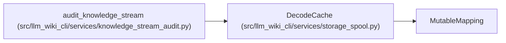

# DecodeCache

**Location:** `src/llm_wiki_cli/services/storage_spool.py:140`
**Kind:** Class
**Bases:** `MutableMapping`
**Module:** [storage_spool](../modules/storage_spool.md)

## Description

Bound encoded cache weight; never reuse this cache across captures.

## Attributes

*No annotated attributes found.*

## Methods

| Method | Signature | Decorators | Description |
|--------|-----------|------------|-------------|
| `__init__` | `(maximum = 2097152)` | — | — |
| `__getitem__` | `(key)` | — | — |
| `__setitem__` | `(key, value)` | — | — |
| `__delitem__` | `(key)` | — | — |
| `__iter__` | `()` | — | — |
| `__len__` | `()` | — | — |

## Relationships

<!-- Auto-generated relationship summary. Do not edit by hand. -->

### Summary

| Module | Methods | Attributes |
|---|---:|---|
| [storage_spool](../modules/storage_spool.md) | 6 | — |

### Structure

| Kind | Entity | Module |
|---|---|---|
| Base | `MutableMapping` | — |

### References

| Reference | Kind | Source | Call sites |
|---|---|---|---:|
| `audit_knowledge_stream` | call | [knowledge_stream_audit](../modules/knowledge_stream_audit.md) | 2 |
