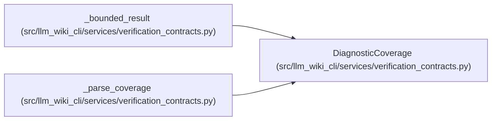

# DiagnosticCoverage

**Location:** `src/llm_wiki_cli/services/verification_contracts.py:139`
**Kind:** Class
**Bases:** —
**Module:** [verification_contracts](../modules/verification_contracts.md)

**Decorators:** `@dataclass(frozen=True)`

## Description

Disclosure for deterministic diagnostic truncation.

## Attributes

| Name | Type | Default | Description |
|------|------|---------|-------------|
| `observed` | `int` | *required* | — |
| `emitted` | `int` | *required* | — |
| `omitted` | `int` | *required* | — |
| `limit` | `int` | `MAX_DIAGNOSTICS_PER_CHECK` | — |
| `truncated` | `bool` | `False` | — |

## Methods

| Method | Signature | Decorators | Description |
|--------|-----------|------------|-------------|
| `__post_init__` | `() -> None` | — | — |
| `to_payload` | `() -> dict[str, int \| bool]` | — | — |

## Relationships

<!-- Auto-generated relationship summary. Do not edit by hand. -->

### Summary

| Module | Methods | Attributes |
|---|---:|---|
| [verification_contracts](../modules/verification_contracts.md) | 2 | `emitted`, `limit`, `observed`, `omitted`, `truncated` |

### References

| Reference | Kind | Source |
|---|---|---|
| `_bounded_result` | call | [verification_contracts](../modules/verification_contracts.md) |
| `_parse_coverage` | call | [verification_contracts](../modules/verification_contracts.md) |
| `_parse_coverage` | type_reference | [verification_contracts](../modules/verification_contracts.md) |
