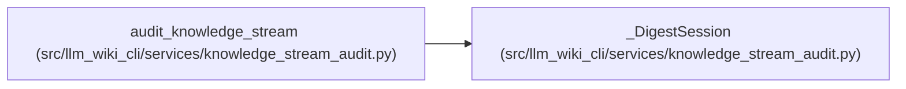

# _DigestSession

**Location:** `src/llm_wiki_cli/services/knowledge_stream_audit.py:34`
**Kind:** Class
**Bases:** —
**Module:** [knowledge_stream_audit](../modules/knowledge_stream_audit.md)

## Description

_Auto-generated from `_DigestSession` in `src/llm_wiki_cli/services/knowledge_stream_audit.py`._

## Attributes

*No annotated attributes found.*

## Methods

| Method | Signature | Decorators | Description |
|--------|-----------|------------|-------------|
| `__init__` | `(root)` | — | — |
| `read` | `(name, maximum)` | — | — |
| `recheck` | `()` | — | — |

## Relationships

<!-- Auto-generated relationship summary. Do not edit by hand. -->

### Summary

| Module | Methods | Attributes |
|---|---:|---|
| [knowledge_stream_audit](../modules/knowledge_stream_audit.md) | 3 | — |

### References

| Reference | Kind | Source | Call sites |
|---|---|---|---:|
| `audit_knowledge_stream` | call | [knowledge_stream_audit](../modules/knowledge_stream_audit.md) | 1 |
