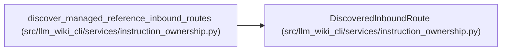

# DiscoveredInboundRoute

**Location:** `src/llm_wiki_cli/services/instruction_ownership.py:172`
**Kind:** Class
**Bases:** —
**Module:** [instruction_ownership](../modules/instruction_ownership.md)

**Decorators:** `@dataclass(frozen=True)`

## Description

Source-derived route identity used to audit the declared inventory.

## Attributes

| Name | Type | Default | Description |
|------|------|---------|-------------|
| `source_path` | `str` | *required* | — |
| `kind` | `InboundRouteKind` | *required* | — |
| `destination_path` | `str` | *required* | — |
| `destination_heading` | `str` | *required* | — |
| `destination_anchor` | `str` | *required* | — |

## Methods

*No public methods. Inherits from base classes.*

## Relationships

<!-- Auto-generated relationship summary. Do not edit by hand. -->

### Summary

| Module | Methods | Attributes |
|---|---:|---|
| [instruction_ownership](../modules/instruction_ownership.md) | 0 | `destination_anchor`, `destination_heading`, `destination_path`, `kind`, `source_path` |

### References

| Reference | Kind | Source |
|---|---|---|
| `discover_managed_reference_inbound_routes` | call | [instruction_ownership](../modules/instruction_ownership.md) |
| `discover_managed_reference_inbound_routes` | call | [instruction_ownership](../modules/instruction_ownership.md) |
| `discover_managed_reference_inbound_routes` | call | [instruction_ownership](../modules/instruction_ownership.md) |
| `discover_managed_reference_inbound_routes` | type_reference | [instruction_ownership](../modules/instruction_ownership.md) |
