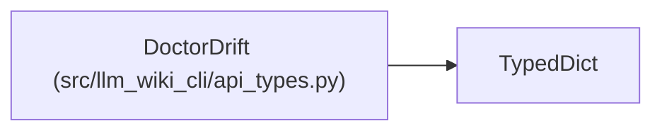

# DoctorDrift

**Location:** `src/llm_wiki_cli/api_types.py:221`
**Kind:** Class
**Bases:** `TypedDict`
**Module:** [api_types](../modules/api_types.md)

## Description

_Auto-generated from `DoctorDrift` in `src/llm_wiki_cli/api_types.py`._

## Attributes

| Name | Type | Default | Description |
|------|------|---------|-------------|
| `state` | `str` | *required* | — |
| `confirmed_stale` | `int` | *required* | — |
| `indeterminate` | `int` | *required* | — |
| `nonsemantic_changes` | `int` | *required* | — |
| `counts_by_state` | `dict[str, int] \| None` | *required* | — |
| `diagnostic_count` | `int` | *required* | — |
| `reasons` | `list[str]` | *required* | — |

## Methods

*No public methods. Inherits from base classes.*

## Relationships

<!-- Auto-generated relationship summary. Do not edit by hand. -->

### Summary

| Module | Methods | Attributes |
|---|---:|---|
| [api_types](../modules/api_types.md) | 0 | `confirmed_stale`, `counts_by_state`, `diagnostic_count`, `indeterminate`, `nonsemantic_changes`, `reasons`, `state` |

### Structure

| Kind | Entity | Module |
|---|---|---|
| Base | `TypedDict` | — |
