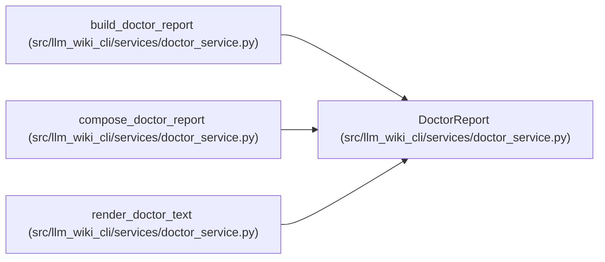

# DoctorReport

**Location:** `src/llm_wiki_cli/services/doctor_service.py:71`
**Kind:** Class
**Bases:** —
**Module:** [doctor_service](../modules/doctor_service.md)

**Decorators:** `@dataclass(frozen=True)`

## Description

One stable machine report plus its process exit classification.

## Attributes

| Name | Type | Default | Description |
|------|------|---------|-------------|
| `status` | `DoctorStatus` | *required* | — |
| `strict` | `bool` | *required* | — |
| `wiki_dir` | `str` | *required* | — |
| `src_dir` | `str` | *required* | — |
| `availability` | `Mapping[str, object]` | *required* | — |
| `freshness` | `Mapping[str, object]` | *required* | — |
| `snapshot_parity` | `Mapping[str, object]` | *required* | — |
| `governance` | `Mapping[str, object]` | *required* | — |
| `drift` | `Mapping[str, object]` | *required* | — |
| `verification_receipt` | `Mapping[str, object]` | *required* | — |
| `degraded_reasons` | `tuple[str, ...]` | `()` | — |
| `unhealthy_reasons` | `tuple[str, ...]` | `()` | — |

## Methods

| Method | Signature | Decorators | Description |
|--------|-----------|------------|-------------|
| `exit_code` | `() -> int` | `@property` | — |
| `to_payload` | `() -> dict[str, object]` | — | — |

## Relationships

<!-- Auto-generated relationship summary. Do not edit by hand. -->

### Summary

| Module | Methods | Attributes |
|---|---:|---|
| [doctor_service](../modules/doctor_service.md) | 2 | `availability`, `degraded_reasons`, `drift`, `freshness`, `governance`, `snapshot_parity`, `src_dir`, `status`, `strict`, `unhealthy_reasons`, `verification_receipt`, `wiki_dir` |

### References

| Reference | Kind | Source | Call sites |
|---|---|---|---:|
| `build_doctor_report` | type_reference | [doctor_service](../modules/doctor_service.md) | — |
| `compose_doctor_report` | call | [doctor_service](../modules/doctor_service.md) | 1 |
| `compose_doctor_report` | type_reference | [doctor_service](../modules/doctor_service.md) | — |
| `render_doctor_text` | type_reference | [doctor_service](../modules/doctor_service.md) | — |
