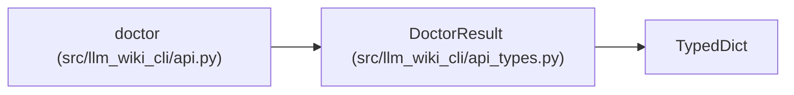

# DoctorResult

**Location:** `src/llm_wiki_cli/api_types.py:374`
**Kind:** Class
**Bases:** `TypedDict`
**Module:** [api_types](../modules/api_types.md)

## Description

Stable ``llm-wiki-doctor/v1`` Python API payload.

## Attributes

| Name | Type | Default | Description |
|------|------|---------|-------------|
| `schema_version` | `str` | *required* | — |
| `status` | `str` | *required* | — |
| `exit_code` | `int` | *required* | — |
| `strict` | `bool` | *required* | — |
| `wiki_dir` | `str` | *required* | — |
| `src_dir` | `str` | *required* | — |
| `availability` | `DoctorAvailability` | *required* | — |
| `freshness` | `DoctorFreshness` | *required* | — |
| `snapshot_parity` | `DoctorSnapshotParity` | *required* | — |
| `governance` | `DoctorGovernance` | *required* | — |
| `drift` | `DoctorDrift` | *required* | — |
| `verification_receipt` | `DoctorVerificationReceipt` | *required* | — |
| `degraded_reasons` | `list[str]` | *required* | — |
| `unhealthy_reasons` | `list[str]` | *required* | — |

## Methods

*No public methods. Inherits from base classes.*

## Relationships

<!-- Auto-generated relationship summary. Do not edit by hand. -->

### Summary

| Module | Methods | Attributes |
|---|---:|---|
| [api_types](../modules/api_types.md) | 0 | `availability`, `degraded_reasons`, `drift`, `exit_code`, `freshness`, `governance`, `schema_version`, `snapshot_parity`, `src_dir`, `status`, `strict`, `unhealthy_reasons` |

### Structure

| Kind | Entity | Module |
|---|---|---|
| Base | `TypedDict` | — |

### References

| Reference | Kind | Source |
|---|---|---|
| `doctor` | type_reference | [api](../modules/api.md) |
