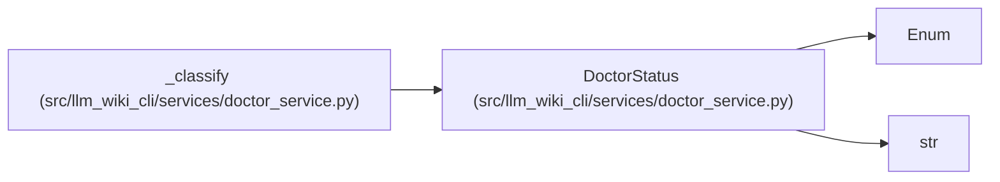

# DoctorStatus

**Location:** `src/llm_wiki_cli/services/doctor_service.py:37`
**Kind:** Enum
**Bases:** `str`, `Enum`
**Module:** [doctor_service](../modules/doctor_service.md)

## Description

Closed overall health vocabulary for the doctor contract.

## Attributes

| Name | Declared value | Description |
|------|-------|-------------|
| `HEALTHY` | `'healthy'` | — |
| `DEGRADED` | `'degraded'` | — |
| `UNHEALTHY` | `'unhealthy'` | — |
| `ABSENT` | `'absent'` | — |

## Methods

*No public methods. Inherits from base classes.*

## Relationships

<!-- Auto-generated relationship summary. Do not edit by hand. -->

### Summary

| Module | Methods | Attributes |
|---|---:|---|
| [doctor_service](../modules/doctor_service.md) | 0 | `ABSENT`, `DEGRADED`, `HEALTHY`, `UNHEALTHY` |

### Structure

| Kind | Entity | Module |
|---|---|---|
| Base | `Enum` | — |
| Base | `str` | — |

### References

| Reference | Kind | Source | Call sites |
|---|---|---|---:|
| `_classify` | type_reference | [doctor_service](../modules/doctor_service.md) | — |
