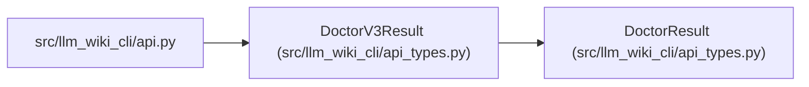

# DoctorV3Result

**Location:** `src/llm_wiki_cli/api_types.py:575`
**Kind:** Class
**Bases:** `DoctorResult`
**Module:** [api_types](../modules/api_types.md)

## Description

Opt-in health report with captured coverage and comparison evidence.

## Attributes

| Name | Type | Presence | Description |
|------|------|----------|-------------|
| `health_details` | `HealthDetails` | *required* | — |

## Methods

*No public methods. Inherits from base classes.*

## Relationships

<!-- Auto-generated relationship summary. Do not edit by hand. -->

### Summary

| Module | Methods | Attributes |
|---|---:|---|
| [api_types](../modules/api_types.md) | 0 | `health_details` |

### Structure

| Kind | Entity | Module |
|---|---|---|
| Base | `DoctorResult` | [api_types](../modules/api_types.md) |

### References

| Reference | Kind | Source | Call sites |
|---|---|---|---:|
| `api` | import | [api](../modules/api.md) | — |
