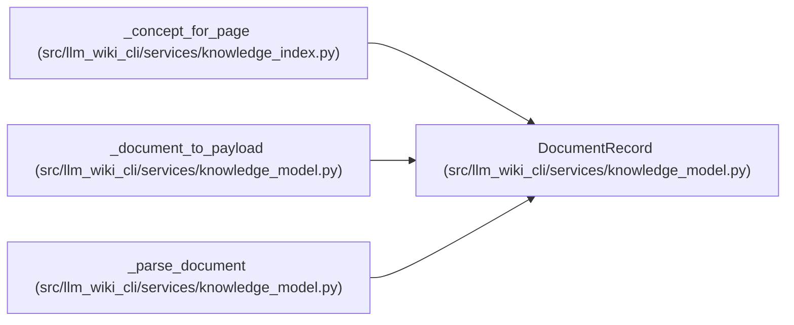

# DocumentRecord

**Location:** `src/llm_wiki_cli/services/knowledge_model.py:327`
**Kind:** Class
**Bases:** —
**Module:** [knowledge_model](../modules/knowledge_model.md)

**Decorators:** `@dataclass(frozen=True)`

## Description

_Auto-generated from `DocumentRecord` in `src/llm_wiki_cli/services/knowledge_model.py`._

## Attributes

| Name | Type | Default | Description |
|------|------|---------|-------------|
| `page_kind` | `PageKind` | *required* | — |
| `page_id` | `str` | *required* | — |
| `canonical_path` | `str` | *required* | — |
| `role` | `SurfaceRole` | *required* | — |
| `extensions` | `Extensions` | `field(default_factory=dict)` | — |

## Methods

*No public methods. Inherits from base classes.*

## Relationships

<!-- Auto-generated relationship summary. Do not edit by hand. -->

### Summary

| Module | Methods | Attributes |
|---|---:|---|
| [knowledge_model](../modules/knowledge_model.md) | 0 | `canonical_path`, `extensions`, `page_id`, `page_kind`, `role` |

### References

| Reference | Kind | Source | Call sites |
|---|---|---|---:|
| `_concept_for_page` | call | [knowledge_index](../modules/knowledge_index.md) | 1 |
| `_document_to_payload` | type_reference | [knowledge_model](../modules/knowledge_model.md) | — |
| `_parse_document` | call | [knowledge_model](../modules/knowledge_model.md) | 1 |
| `_parse_document` | type_reference | [knowledge_model](../modules/knowledge_model.md) | — |
