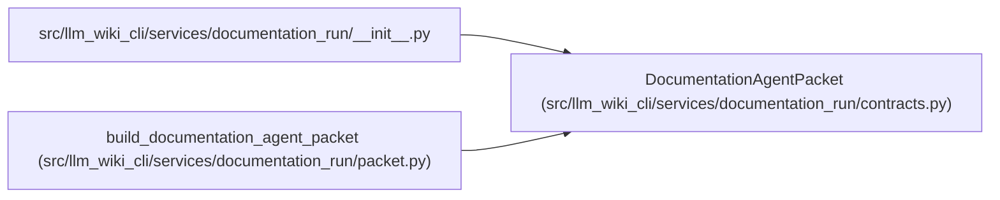

# DocumentationAgentPacket

**Location:** `src/llm_wiki_cli/services/documentation_run/contracts.py:741`
**Kind:** Class
**Bases:** —
**Module:** [documentation_run_contracts](../modules/documentation_run_contracts.md)

**Decorators:** `@dataclass(frozen=True)`

## Description

_Auto-generated from `DocumentationAgentPacket` in `src/llm_wiki_cli/services/documentation_run/contracts.py`._

## Attributes

| Name | Type | Default | Description |
|------|------|---------|-------------|
| `payload` | `dict[str, Any]` | *required* | — |

## Methods

| Method | Signature | Decorators | Description |
|--------|-----------|------------|-------------|
| `run_id` | `() -> str` | `@property` | — |
| `stage` | `() -> str` | `@property` | — |
| `to_dict` | `() -> dict[str, Any]` | — | — |
| `to_json` | `() -> str` | — | — |
| `to_markdown` | `() -> str` | — | — |

## Relationships

<!-- Auto-generated relationship summary. Do not edit by hand. -->

### Summary

| Module | Methods | Attributes |
|---|---:|---|
| [documentation_run_contracts](../modules/documentation_run_contracts.md) | 5 | `payload` |

### References

| Reference | Kind | Source | Call sites |
|---|---|---|---:|
| `__init__` | import | [documentation_run___init__](../modules/documentation_run___init__.md) | — |
| `build_documentation_agent_packet` | call | [packet](../modules/packet.md) | 1 |
