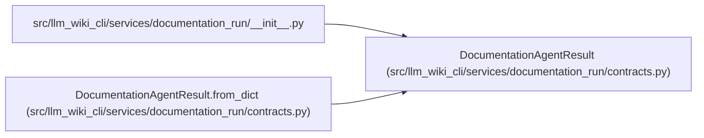

# DocumentationAgentResult

**Location:** `src/llm_wiki_cli/services/documentation_run/contracts.py:763`
**Kind:** Class
**Bases:** —
**Module:** [documentation_run_contracts](../modules/documentation_run_contracts.md)

**Decorators:** `@dataclass(frozen=True)`

## Description

_Auto-generated from `DocumentationAgentResult` in `src/llm_wiki_cli/services/documentation_run/contracts.py`._

## Attributes

| Name | Type | Default | Description |
|------|------|---------|-------------|
| `run_id` | `str` | *required* | — |
| `stage` | `str` | *required* | — |
| `status` | `str` | *required* | — |
| `changed_wiki_paths` | `tuple[str, ...]` | *required* | — |
| `reused_work_ids` | `tuple[str, ...]` | *required* | — |
| `completed_work_ids` | `tuple[str, ...]` | *required* | — |
| `deferred_work_ids` | `tuple[str, ...]` | *required* | — |
| `claims_evidence_pages` | `tuple[str, ...]` | *required* | — |
| `unresolved_unknowns` | `tuple[str, ...]` | *required* | — |
| `unsupported_source_notices` | `tuple[str, ...]` | *required* | — |
| `requested_follow_up_checks` | `tuple[str, ...]` | *required* | — |
| `reported_source_writes` | `tuple[str, ...]` | *required* | — |
| `reported_input_wiki_writes` | `tuple[str, ...]` | *required* | — |
| `reported_generated_block_edits` | `tuple[str, ...]` | *required* | — |
| `claim_evidence` | `tuple[dict[str, Any], ...]` | `()` | — |
| `runtime_captures` | `tuple[dict[str, Any], ...]` | `()` | — |
| `imported_page_edits` | `tuple[dict[str, Any], ...]` | `()` | — |
| `deferral_rationales` | `dict[str, str]` | `field(default_factory=dict)` | — |
| `findings` | `tuple[dict[str, Any], ...]` | `()` | — |
| `schema_version` | `str` | `DOCUMENTATION_AGENT_RESULT_SCHEMA_VERSION` | — |

## Methods

| Method | Signature | Decorators | Description |
|--------|-----------|------------|-------------|
| `from_dict` | `(payload: Mapping[str, Any]) -> 'DocumentationAgentResult'` | `@classmethod` | — |
| `to_dict` | `() -> dict[str, Any]` | — | — |

## Relationships

<!-- Auto-generated relationship summary. Do not edit by hand. -->

### Summary

| Module | Methods | Attributes |
|---|---:|---|
| [documentation_run_contracts](../modules/documentation_run_contracts.md) | 2 | `changed_wiki_paths`, `claim_evidence`, `claims_evidence_pages`, `completed_work_ids`, `deferral_rationales`, `deferred_work_ids`, `findings`, `imported_page_edits`, `reported_generated_block_edits`, `reported_input_wiki_writes`, `reported_source_writes`, `requested_follow_up_checks` |

### References

| Reference | Kind | Source | Call sites |
|---|---|---|---:|
| `__init__` | import | [documentation_run___init__](../modules/documentation_run___init__.md) | — |
| `DocumentationAgentResult.from_dict` | type_reference | [documentation_run_contracts](../modules/documentation_run_contracts.md) | — |
