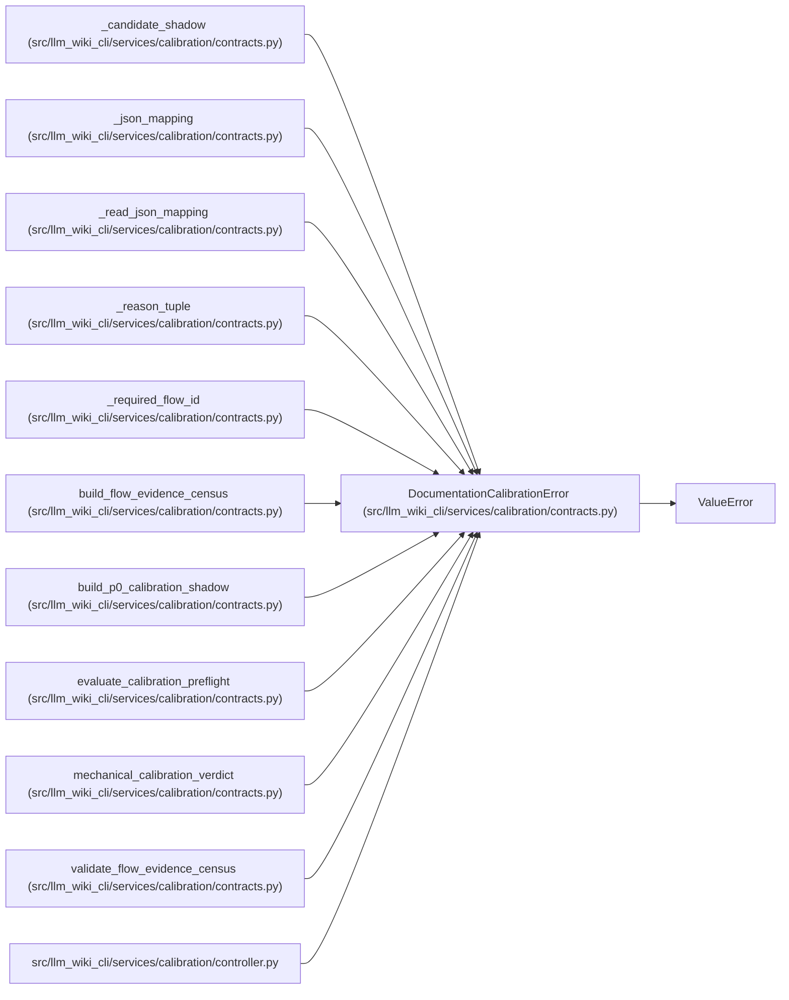

# DocumentationCalibrationError

**Location:** `src/llm_wiki_cli/services/calibration/contracts.py:91`
**Kind:** Class
**Bases:** `ValueError`
**Module:** [calibration_contracts](../modules/calibration_contracts.md)

## Description

Raised when a calibration evidence contract is malformed.

## Attributes

*No annotated attributes found.*

## Methods

*No public methods. Inherits from base classes.*

## Relationships

<!-- Auto-generated relationship summary. Do not edit by hand. -->

### Summary

| Module | Methods | Attributes |
|---|---:|---|
| [calibration_contracts](../modules/calibration_contracts.md) | 0 | — |

### Structure

| Kind | Entity | Module |
|---|---|---|
| Base | `ValueError` | — |

### References

| Reference | Kind | Source | Call sites |
|---|---|---|---:|
| `_candidate_shadow` | call | [calibration_contracts](../modules/calibration_contracts.md) | 3 |
| `_json_mapping` | call | [calibration_contracts](../modules/calibration_contracts.md) | 2 |
| `_read_json_mapping` | call | [calibration_contracts](../modules/calibration_contracts.md) | 3 |
| `_reason_tuple` | call | [calibration_contracts](../modules/calibration_contracts.md) | 1 |
| `_required_flow_id` | call | [calibration_contracts](../modules/calibration_contracts.md) | 1 |
| `build_flow_evidence_census` | call | [calibration_contracts](../modules/calibration_contracts.md) | 4 |
| `build_p0_calibration_shadow` | call | [calibration_contracts](../modules/calibration_contracts.md) | 5 |
| `evaluate_calibration_preflight` | call | [calibration_contracts](../modules/calibration_contracts.md) | 1 |
| `mechanical_calibration_verdict` | call | [calibration_contracts](../modules/calibration_contracts.md) | 1 |
| `validate_flow_evidence_census` | call | [calibration_contracts](../modules/calibration_contracts.md) | 24 |
| `controller` | import | [controller](../modules/controller.md) | — |
