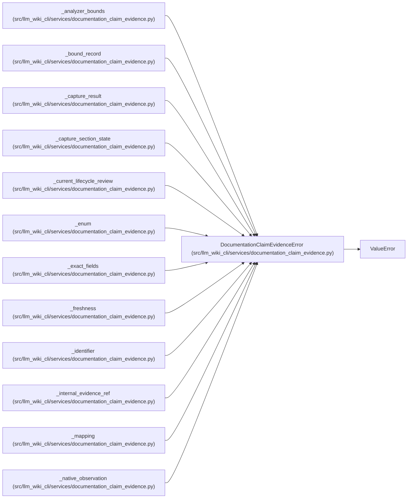

# DocumentationClaimEvidenceError

**Location:** `src/llm_wiki_cli/services/documentation_claim_evidence.py:185`
**Kind:** Class
**Bases:** `ValueError`
**Module:** [documentation_claim_evidence](../modules/documentation_claim_evidence.md)

## Description

Raised when an evidence record is malformed or does not reconcile.

## Attributes

*No annotated attributes found.*

## Methods

*No public methods. Inherits from base classes.*

## Relationships

<!-- Auto-generated relationship summary. Do not edit by hand. -->

### Summary

| Module | Methods | Attributes |
|---|---:|---|
| [documentation_claim_evidence](../modules/documentation_claim_evidence.md) | 0 | — |

### Structure

| Kind | Entity | Module |
|---|---|---|
| Base | `ValueError` | — |

### References

| Reference | Kind | Source | Call sites |
|---|---|---|---:|
| `_analyzer_bounds` | call | [documentation_claim_evidence](../modules/documentation_claim_evidence.md) | 2 |
| `_bound_record` | call | [documentation_claim_evidence](../modules/documentation_claim_evidence.md) | 1 |
| `_capture_result` | call | [documentation_claim_evidence](../modules/documentation_claim_evidence.md) | 3 |
| `_capture_section_state` | call | [documentation_claim_evidence](../modules/documentation_claim_evidence.md) | 2 |
| `_current_lifecycle_review` | call | [documentation_claim_evidence](../modules/documentation_claim_evidence.md) | 2 |
| `_enum` | call | [documentation_claim_evidence](../modules/documentation_claim_evidence.md) | 1 |
| `_exact_fields` | call | [documentation_claim_evidence](../modules/documentation_claim_evidence.md) | 3 |
| `_freshness` | call | [documentation_claim_evidence](../modules/documentation_claim_evidence.md) | 5 |
| `_identifier` | call | [documentation_claim_evidence](../modules/documentation_claim_evidence.md) | 1 |
| `_internal_evidence_ref` | call | [documentation_claim_evidence](../modules/documentation_claim_evidence.md) | 1 |
| `_mapping` | call | [documentation_claim_evidence](../modules/documentation_claim_evidence.md) | 1 |
| `_native_observation` | call | [documentation_claim_evidence](../modules/documentation_claim_evidence.md) | 7 |

> References: showing 12 of 34 logical references; 22 omitted by the 12-row generated summary limit.
