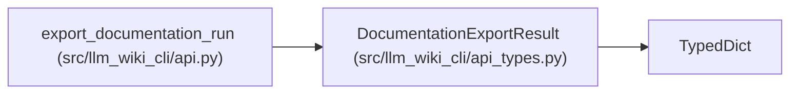

# DocumentationExportResult

**Location:** `src/llm_wiki_cli/api_types.py:305`
**Kind:** Class
**Bases:** `TypedDict`
**Module:** [api_types](../modules/api_types.md)

## Description

Top-level documentation export and verification report.

## Attributes

| Name | Type | Default | Description |
|------|------|---------|-------------|
| `schema_version` | `str` | *required* | — |
| `run_id` | `str` | *required* | — |
| `state` | `str` | *required* | — |
| `verdict` | `str` | *required* | — |
| `source` | `dict[str, Any]` | *required* | — |
| `baseline` | `dict[str, Any]` | *required* | — |
| `intake` | `dict[str, Any]` | *required* | — |
| `skills` | `list[dict[str, Any]]` | *required* | — |
| `coverage` | `dict[str, Any]` | *required* | — |
| `budgets` | `dict[str, Any]` | *required* | — |
| `evidence` | `dict[str, Any]` | *required* | — |
| `execution_route` | `dict[str, Any]` | *required* | — |
| `unresolved_findings` | `list[dict[str, Any]]` | *required* | — |
| `validation` | `dict[str, Any]` | *required* | — |
| `limitations` | `list[str]` | *required* | — |
| `distribution` | `dict[str, Any]` | *required* | — |
| `deployment_handoff` | `dict[str, Any]` | *required* | — |
| `resume` | `dict[str, Any]` | *required* | — |
| `generated_at` | `str` | *required* | — |

## Methods

*No public methods. Inherits from base classes.*

## Relationships

<!-- Auto-generated relationship summary. Do not edit by hand. -->

### Summary

| Module | Methods | Attributes |
|---|---:|---|
| [api_types](../modules/api_types.md) | 0 | `baseline`, `budgets`, `coverage`, `deployment_handoff`, `distribution`, `evidence`, `execution_route`, `generated_at`, `intake`, `limitations`, `resume`, `run_id` |

### Structure

| Kind | Entity | Module |
|---|---|---|
| Base | `TypedDict` | — |

### References

| Reference | Kind | Source |
|---|---|---|
| `export_documentation_run` | type_reference | [api](../modules/api.md) |
