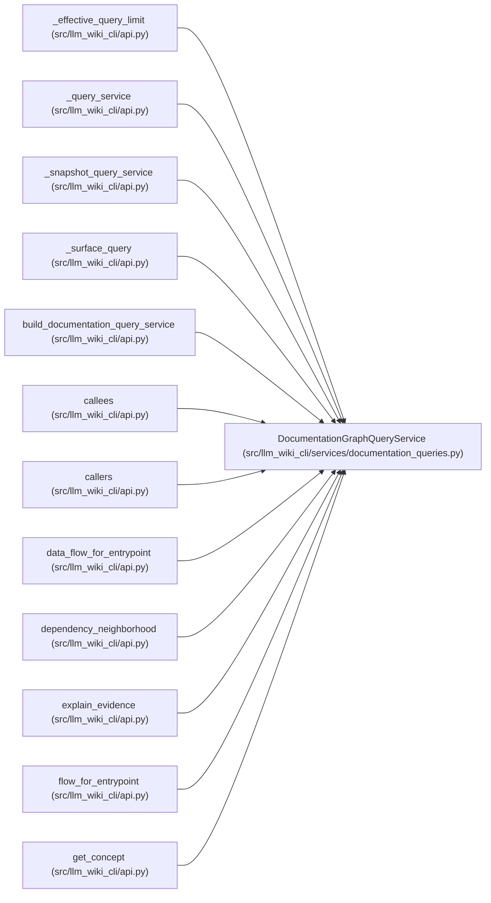

# DocumentationGraphQueryService

**Location:** `src/llm_wiki_cli/services/documentation_queries.py:832`
**Kind:** Class
**Bases:** —
**Module:** [documentation_queries](../modules/documentation_queries.md)

## Description

Read-only graph query service over already-derived documentation payloads.

## Attributes

*No annotated attributes found.*

## Methods

| Method | Signature | Decorators | Description |
|--------|-----------|------------|-------------|
| `__init__` | `(inventory: Mapping[str, Mapping[str, Any]], *, call_edges: Optional[Iterable[Mapping[str, Any]]] = None, flows: Optional[Iterable[Mapping[str, Any]]] = None, data_flows: Optional[object] = None, dependency_analysis: Optional[Mapping[str, Any]] = None, surface_index: Optional[Mapping[str, Any]] = None, limit: int = _DEFAULT_LIMIT, knowledge_view: Optional[KnowledgeReadView] = None, machine_verification: Optional[Mapping[str, Mapping[str, Any]]] = None)` | — | — |
| `flow_for_entrypoint` | `(id_or_symbol: object) -> dict[str, Any]` | `@_bounded_query_result` | Return a bounded user-flow payload for an entry-point id or symbol. |
| `callers` | `(symbol: object) -> dict[str, Any]` | `@_bounded_query_result` | Return bounded callers for exactly one callable symbol. |
| `callees` | `(symbol: object) -> dict[str, Any]` | `@_bounded_query_result` | Return bounded callees for exactly one callable symbol. |
| `dependency_neighborhood` | `(path: object) -> dict[str, Any]` | `@_bounded_query_result` | Return bounded inbound/outbound dependency neighbors for a source path. |
| `data_flow_for_entrypoint` | `(id_or_symbol: object) -> dict[str, Any]` | `@_bounded_query_result` | Return a bounded data-flow payload for an entry-point id or symbol. |
| `pages_for_symbol` | `(symbol: object) -> dict[str, Any]` | `@_bounded_query_result` | Return bounded wiki surface pages related to exactly one symbol. |
| `broad_context_selection` | `(source_priorities: Mapping[str, str], *, concept_limit: int = 20, page_limit: int = 20, relationship_limit: int = 40) -> dict[str, Any]` | — | Select bounded native context for a relevance-classified source set. |
| `get_concept` | `(locator_or_exact_route: object) -> dict[str, Any]` | `@_bounded_query_result` | Return one concept selected by current coordinate, UID, or alias. |
| `related_concepts` | `(locator_or_exact_route: object, *, direction: str = 'both', kinds: Optional[Iterable[str]] = None) -> dict[str, Any]` | `@_bounded_query_result` | Return bounded relationship observations for one exact identity. |
| `list_concept_sections` | `(locator_or_exact_route: object, *, ownership: str \| None = None) -> dict[str, Any]` | `@_bounded_query_result` | Return bounded document-order sections for one exact concept. |
| `traverse_typed_graph` | `(locator_or_exact_route: object, *, direction: str = 'both', kinds: Optional[Iterable[str]] = None, origins: Optional[Iterable[str]] = None, resolutions: Optional[Iterable[str]] = None, include_evidence: bool = False) -> dict[str, Any]` | `@_bounded_query_result` | Return a bounded traversal of the persisted typed-graph extension. |
| `explain_evidence` | `(locator_or_exact_route: object) -> dict[str, Any]` | `@_bounded_query_result` | Return full stored and computed evidence for one exact identity. |
| `_build_knowledge_indexes` | `(knowledge_view: Optional[KnowledgeReadView]) -> None` | — | — |
| `_build_section_ownership_indexes` | `(payload: Mapping[str, Any]) -> None` | — | — |
| `_build_typed_graph_indexes` | `(payload: Mapping[str, Any]) -> None` | — | — |
| `_typed_graph_concept_locator` | `(endpoint: object) -> str \| None` | — | Resolve a locator- or durable-UID concept endpoint. |
| `_knowledge_selection_result` | `(query: str) -> dict[str, Any]` | — | — |
| `_compact_knowledge_concept` | `(locator: str) -> dict[str, Any]` | — | — |
| `_compact_context_concept` | `(locator: str) -> dict[str, Any]` | — | Return a compact concept with the explicit context freshness contract. |
| `_compact_section` | `(concept_locator: str, section: Mapping[str, Any]) -> dict[str, Any]` | — | Project one section without raw hashes or review authorship. |
| `_compact_section_review` | `(concept_locator: str, section_locator: str) -> dict[str, Any]` | — | — |
| `_compact_knowledge_freshness` | `(locator: str) -> dict[str, Any]` | — | — |
| `_full_knowledge_freshness` | `(locator: str) -> Optional[dict[str, Any]]` | — | — |
| `_knowledge_direction` | `(value: object) -> str` | — | — |
| `_section_ownership_filter` | `(value: object) -> str \| None` | — | — |
| `_knowledge_kinds` | `(values: Optional[Iterable[str]]) -> tuple[str, ...]` | — | — |
| `_typed_graph_direction` | `(value: object) -> str` | — | — |
| `_typed_graph_kinds` | `(values: Optional[Iterable[str]]) -> tuple[str, ...]` | — | — |
| `_typed_graph_enum_filter` | `(values: Optional[Iterable[str]], *, field: str, allowed: Sequence[str]) -> tuple[str, ...]` | — | — |
| `_incident_typed_graph_edges` | `(locator: str, direction: str) -> list[tuple[int, str]]` | — | — |
| `_compact_typed_graph_edge` | `(index: int, direction: str, *, include_evidence: bool) -> dict[str, Any]` | — | — |
| `_resolved_target_locator` | `(relationship: Mapping[str, Any]) -> Optional[str]` | — | — |
| `_incident_knowledge_relationships` | `(locator: str, direction: str) -> list[tuple[int, str]]` | — | — |
| `_compact_knowledge_relationship` | `(index: int, direction: str) -> dict[str, Any]` | — | — |
| `_normalise_data_flows` | `(data_flows: Optional[object]) -> list[dict[str, Any]]` | — | — |
| `_dependency_payload` | `(dependency_analysis: Optional[Mapping[str, Any]]) -> dict[str, Any]` | — | — |
| `_surface_pages` | `(surface_index: Mapping[str, Any]) -> list[dict[str, Any]]` | — | — |
| `_build_graph_query_indexes` | `() -> None` | — | Index exact graph coordinates once for local query-time work. |
| `_dependency_edges` | `() -> list[tuple[str, str]]` | — | — |
| `_raw_function_links` | `() -> tuple[dict[tuple[object, object], list[dict[str, Any]]], dict[tuple[object, object], list[dict[str, Any]]]]` | — | — |
| `_callable_matches` | `(query: str) -> list[dict[str, Any]]` | — | — |
| `_symbol_matches` | `(query: str) -> list[dict[str, Any]]` | — | — |
| `_flow_matches` | `(query: str, index: Mapping[str, Sequence[dict[str, Any]]]) -> list[dict[str, Any]]` | — | — |
| `_selection_result` | `(query: str, matches: Sequence[Mapping[str, Any]], payload_key: str, empty_payload: object) -> dict[str, Any]` | — | — |
| `_pages_for_source` | `(source_path: object) -> _BoundedResult` | — | — |
| `_bounded_payload` | `(payload: object, list_keys: tuple[str, ...]) -> tuple[dict[str, Any], dict[str, _BoundedResult]]` | — | — |
| `_bounded` | `(records: Iterable[object]) -> _BoundedResult` | — | — |
| `_bounded_strings` | `(values: Iterable[object]) -> _BoundedResult` | — | — |
| `_record_bound` | `(result: dict[str, Any], path: str, bounded: _BoundedResult) -> None` | — | — |
| `_sync_truncated` | `(result: dict[str, Any]) -> None` | `@staticmethod` | — |

## Relationships

<!-- Auto-generated relationship summary. Do not edit by hand. -->

### Summary

| Module | Methods | Attributes |
|---|---:|---|
| [documentation_queries](../modules/documentation_queries.md) | 51 | — |

### References

| Reference | Kind | Source |
|---|---|---|
| `_effective_query_limit` | type_reference | [api](../modules/api.md) |
| `_query_service` | type_reference | [api](../modules/api.md) |
| `_snapshot_query_service` | type_reference | [api](../modules/api.md) |
| `_surface_query` | type_reference | [api](../modules/api.md) |
| `build_documentation_query_service` | type_reference | [api](../modules/api.md) |
| `callees` | type_reference | [api](../modules/api.md) |
| `callers` | type_reference | [api](../modules/api.md) |
| `data_flow_for_entrypoint` | type_reference | [api](../modules/api.md) |
| `dependency_neighborhood` | type_reference | [api](../modules/api.md) |
| `explain_evidence` | type_reference | [api](../modules/api.md) |
| `flow_for_entrypoint` | type_reference | [api](../modules/api.md) |
| `get_concept` | type_reference | [api](../modules/api.md) |
