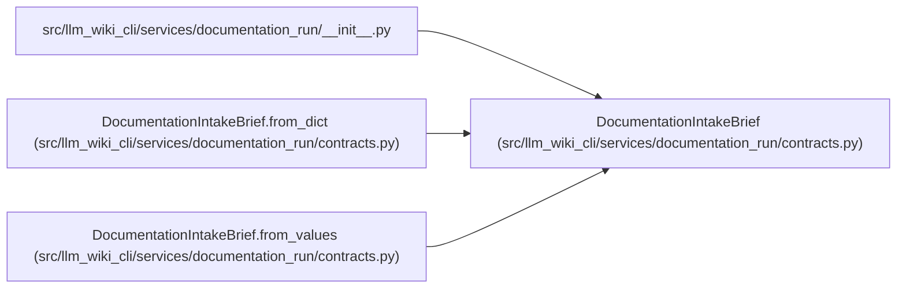

# DocumentationIntakeBrief

**Location:** `src/llm_wiki_cli/services/documentation_run/contracts.py:259`
**Kind:** Class
**Bases:** —
**Module:** [documentation_run_contracts](../modules/documentation_run_contracts.md)

**Decorators:** `@dataclass(frozen=True)`

## Description

_Auto-generated from `DocumentationIntakeBrief` in `src/llm_wiki_cli/services/documentation_run/contracts.py`._

## Attributes

| Name | Type | Default | Description |
|------|------|---------|-------------|
| `project_purpose` | `str` | *required* | — |
| `audiences` | `tuple[str, ...]` | *required* | — |
| `audience_intent` | `dict[str, str]` | *required* | — |
| `live_service` | `dict[str, Any]` | *required* | — |
| `provenance` | `dict[str, Any]` | *required* | — |
| `recorded_at` | `str` | *required* | — |

## Methods

| Method | Signature | Decorators | Description |
|--------|-----------|------------|-------------|
| `from_values` | `(*, project_purpose: str \| None, audiences: Iterable[str] \| None, audience_intent: Mapping[str, str] \| None = None, live_service_url: str \| None = None, live_service_access_mode: str = 'unspecified', live_service_observation_allowed: bool = False, recorded_at: str \| None = None) -> 'DocumentationIntakeBrief'` | `@classmethod` | — |
| `to_dict` | `() -> dict[str, Any]` | — | — |
| `from_dict` | `(payload: Mapping[str, Any]) -> 'DocumentationIntakeBrief'` | `@classmethod` | — |

## Relationships

<!-- Auto-generated relationship summary. Do not edit by hand. -->

### Summary

| Module | Methods | Attributes |
|---|---:|---|
| [documentation_run_contracts](../modules/documentation_run_contracts.md) | 3 | `audience_intent`, `audiences`, `live_service`, `project_purpose`, `provenance`, `recorded_at` |

### References

| Reference | Kind | Source | Call sites |
|---|---|---|---:|
| `__init__` | import | [documentation_run___init__](../modules/documentation_run___init__.md) | — |
| `DocumentationIntakeBrief.from_dict` | type_reference | [documentation_run_contracts](../modules/documentation_run_contracts.md) | — |
| `DocumentationIntakeBrief.from_values` | type_reference | [documentation_run_contracts](../modules/documentation_run_contracts.md) | — |
