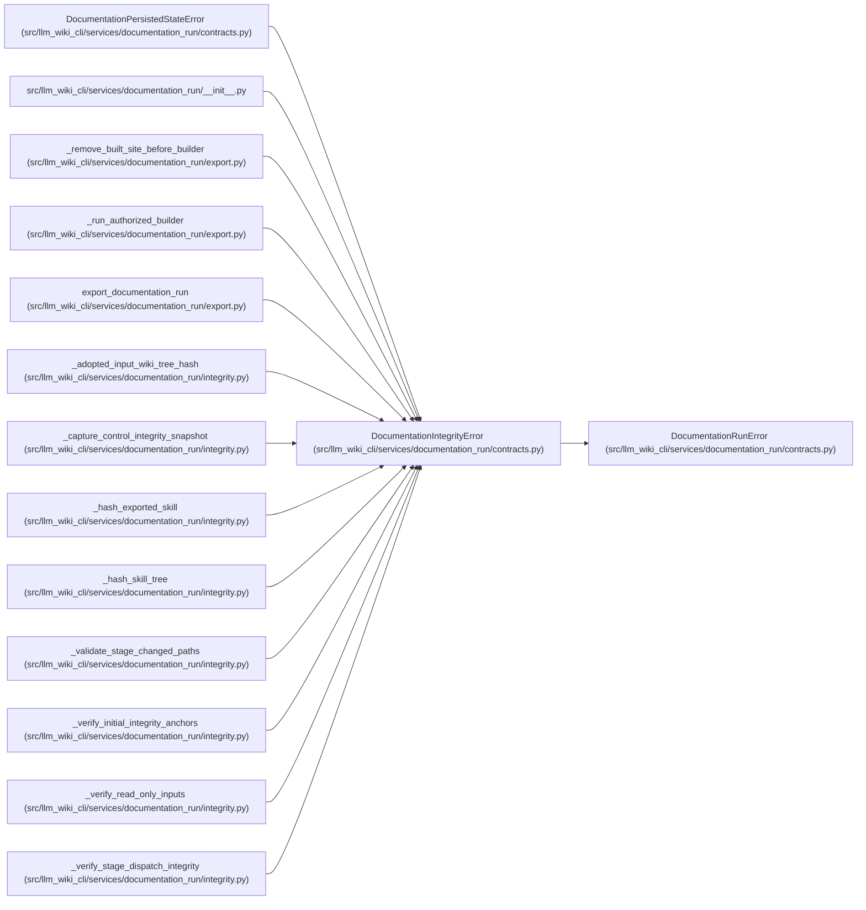

# DocumentationIntegrityError

**Location:** `src/llm_wiki_cli/services/documentation_run/contracts.py:247`
**Kind:** Class
**Bases:** `DocumentationRunError`
**Module:** [documentation_run_contracts](../modules/documentation_run_contracts.md)

## Description

Raised when source, input-wiki, or generated ownership changed.

## Attributes

*No annotated attributes found.*

## Methods

*No public methods. Inherits from base classes.*

## Relationships

<!-- Auto-generated relationship summary. Do not edit by hand. -->

### Summary

| Module | Methods | Attributes |
|---|---:|---|
| [documentation_run_contracts](../modules/documentation_run_contracts.md) | 0 | — |

### Structure

| Kind | Entity | Module |
|---|---|---|
| Base | `DocumentationRunError` | [documentation_run_contracts](../modules/documentation_run_contracts.md) |
| Subclass | `DocumentationPersistedStateError` | [documentation_run_contracts](../modules/documentation_run_contracts.md) |

### References

| Reference | Kind | Source | Call sites |
|---|---|---|---:|
| `__init__` | import | [documentation_run___init__](../modules/documentation_run___init__.md) | — |
| `_remove_built_site_before_builder` | call | [export](../modules/export.md) | 7 |
| `_run_authorized_builder` | call | [export](../modules/export.md) | 1 |
| `export_documentation_run` | call | [export](../modules/export.md) | 5 |
| `_adopted_input_wiki_tree_hash` | call | [integrity](../modules/integrity.md) | 1 |
| `_capture_control_integrity_snapshot` | call | [integrity](../modules/integrity.md) | 2 |
| `_hash_exported_skill` | call | [integrity](../modules/integrity.md) | 3 |
| `_hash_skill_tree` | call | [integrity](../modules/integrity.md) | 1 |
| `_validate_stage_changed_paths` | call | [integrity](../modules/integrity.md) | 3 |
| `_verify_initial_integrity_anchors` | call | [integrity](../modules/integrity.md) | 10 |
| `_verify_read_only_inputs` | call | [integrity](../modules/integrity.md) | 7 |
| `_verify_stage_dispatch_integrity` | call | [integrity](../modules/integrity.md) | 12 |

> References: showing 12 of 60 logical references; 48 omitted by the 12-row generated summary limit.
