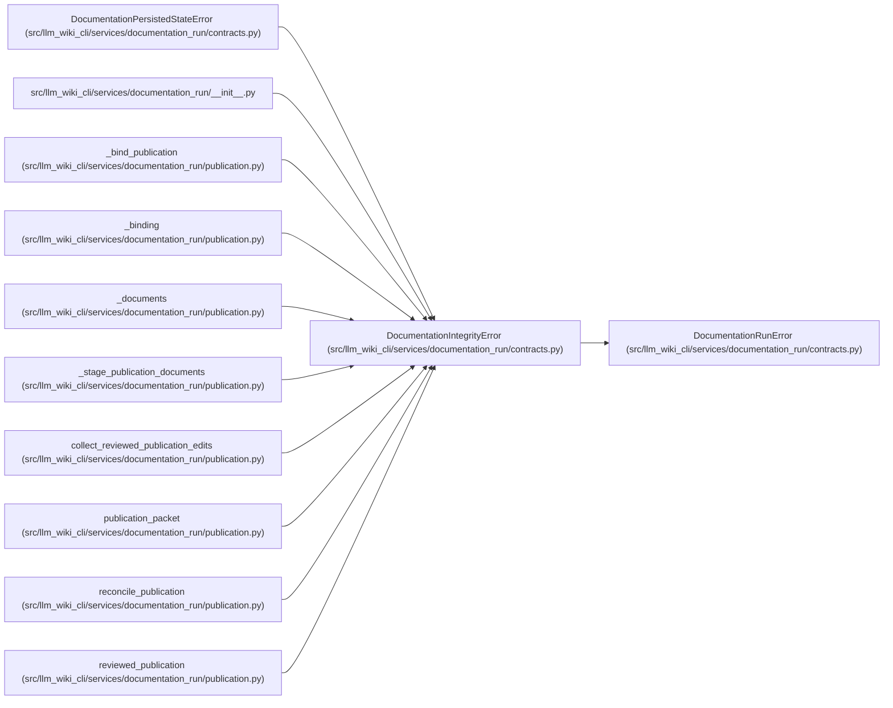

# DocumentationIntegrityError

**Location:** `src/llm_wiki_cli/services/documentation_run/contracts.py:310`
**Kind:** Class
**Bases:** `DocumentationRunError`
**Module:** [documentation_run_contracts](../modules/documentation_run_contracts.md)

## Description

Raised when source, input-wiki, or generated ownership changed.

## Attributes

*No annotated attributes found.*

## Methods

*No declared methods.*

## Relationships

<!-- Auto-generated relationship summary. Do not edit by hand. -->

```mermaid
flowchart LR
    n0["DocumentationIntegrityError (src/llm_wiki_cli/services/documentation_run/contracts.py)"]
    n1["DocumentationRunError (src/llm_wiki_cli/services/documentation_run/contracts.py)"]
    n2["DocumentationPersistedStateError (src/llm_wiki_cli/services/documentation_run/contracts.py)"]
    n3["src/llm_wiki_cli/services/documentation_run/__init__.py"]
    n4["_bind_publication (src/llm_wiki_cli/services/documentation_run/publication.py)"]
    n5["_binding (src/llm_wiki_cli/services/documentation_run/publication.py)"]
    n6["_documents (src/llm_wiki_cli/services/documentation_run/publication.py)"]
    n7["_stage_publication_documents (src/llm_wiki_cli/services/documentation_run/publication.py)"]
    n8["collect_reviewed_publication_edits (src/llm_wiki_cli/services/documentation_run/publication.py)"]
    n9["publication_packet (src/llm_wiki_cli/services/documentation_run/publication.py)"]
    n10["reconcile_publication (src/llm_wiki_cli/services/documentation_run/publication.py)"]
    n11["reviewed_publication (src/llm_wiki_cli/services/documentation_run/publication.py)"]
    n0 --> n1
    n2 --> n0
    n3 --> n0
    n4 --> n0
    n5 --> n0
    n6 --> n0
    n7 --> n0
    n8 --> n0
    n9 --> n0
    n10 --> n0
    n11 --> n0
    click n0 "../modules/documentation_run_contracts.md"
    click n1 "../modules/documentation_run_contracts.md"
    click n2 "../modules/documentation_run_contracts.md"
    click n3 "../modules/documentation_run___init__.md"
    click n4 "../modules/publication.md"
    click n5 "../modules/publication.md"
    click n6 "../modules/publication.md"
    click n7 "../modules/publication.md"
    click n8 "../modules/publication.md"
    click n9 "../modules/publication.md"
    click n10 "../modules/publication.md"
    click n11 "../modules/publication.md"
```

### Summary

| Module | Methods | Attributes |
|---|---:|---|
| [documentation_run_contracts](../modules/documentation_run_contracts.md) | 0 | — |

### Structure

| Kind | Entity | Module |
|---|---|---|
| Base | `DocumentationRunError` | [documentation_run_contracts](../modules/documentation_run_contracts.md) |
| Subclass | `DocumentationPersistedStateError` | [documentation_run_contracts](../modules/documentation_run_contracts.md) |

### References

| Reference | Kind | Source | Call sites |
|---|---|---|---:|
| `__init__` | import | [documentation_run___init__](../modules/documentation_run___init__.md) | — |
| `_bind_publication` | call | [publication](../modules/publication.md) | 5 |
| `_binding` | call | [publication](../modules/publication.md) | 1 |
| `_documents` | call | [publication](../modules/publication.md) | 2 |
| `_stage_publication_documents` | call | [publication](../modules/publication.md) | 2 |
| `collect_reviewed_publication_edits` | call | [publication](../modules/publication.md) | 1 |
| `publication_packet` | call | [publication](../modules/publication.md) | 2 |
| `reconcile_publication` | call | [publication](../modules/publication.md) | 3 |
| `reviewed_publication` | call | [publication](../modules/publication.md) | 4 |
