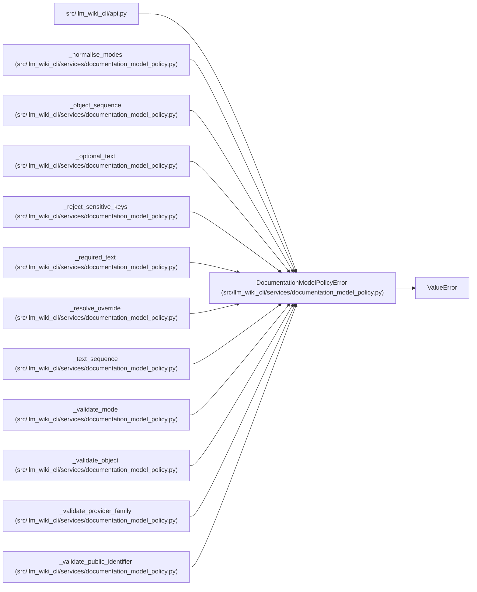

# DocumentationModelPolicyError

**Location:** `src/llm_wiki_cli/services/documentation_model_policy.py:82`
**Kind:** Class
**Bases:** `ValueError`
**Module:** [documentation_model_policy](../modules/documentation_model_policy.md)

## Description

Raised when model-routing configuration is unsafe or ambiguous.

## Attributes

*No annotated attributes found.*

## Methods

*No public methods. Inherits from base classes.*

## Relationships

<!-- Auto-generated relationship summary. Do not edit by hand. -->

### Summary

| Module | Methods | Attributes |
|---|---:|---|
| [documentation_model_policy](../modules/documentation_model_policy.md) | 0 | — |

### Structure

| Kind | Entity | Module |
|---|---|---|
| Base | `ValueError` | — |

### References

| Reference | Kind | Source | Call sites |
|---|---|---|---:|
| `api` | import | [api](../modules/api.md) | — |
| `_normalise_modes` | call | [documentation_model_policy](../modules/documentation_model_policy.md) | 2 |
| `_object_sequence` | call | [documentation_model_policy](../modules/documentation_model_policy.md) | 1 |
| `_optional_text` | call | [documentation_model_policy](../modules/documentation_model_policy.md) | 1 |
| `_reject_sensitive_keys` | call | [documentation_model_policy](../modules/documentation_model_policy.md) | 1 |
| `_required_text` | call | [documentation_model_policy](../modules/documentation_model_policy.md) | 1 |
| `_resolve_override` | call | [documentation_model_policy](../modules/documentation_model_policy.md) | 1 |
| `_text_sequence` | call | [documentation_model_policy](../modules/documentation_model_policy.md) | 1 |
| `_validate_mode` | call | [documentation_model_policy](../modules/documentation_model_policy.md) | 2 |
| `_validate_object` | call | [documentation_model_policy](../modules/documentation_model_policy.md) | 3 |
| `_validate_provider_family` | call | [documentation_model_policy](../modules/documentation_model_policy.md) | 2 |
| `_validate_public_identifier` | call | [documentation_model_policy](../modules/documentation_model_policy.md) | 5 |

> References: showing 12 of 25 logical references; 13 omitted by the 12-row generated summary limit.
